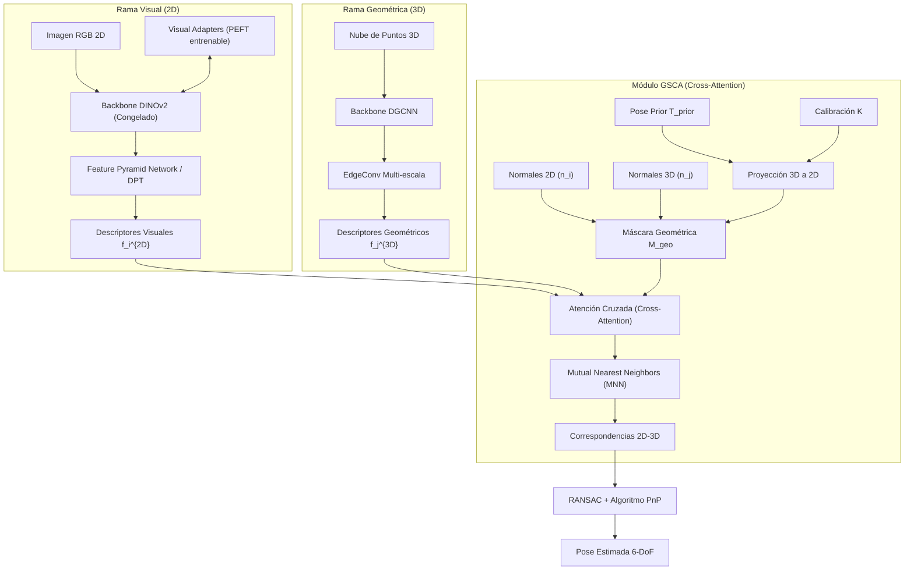

# Arquitectura GSCA: Mapeo Cross-Domain 2D-3D en Afloramientos Geológicos

Este directorio contiene la documentación técnica detallada de la metodología y arquitectura planteada en el informe **"Cross-Domain descriptor learning for 2D-3D matching on geological outcrops"** por Marco Repetto Jara.

El objetivo central de la arquitectura **GSCA (Geo-Structural Cross-Attention)** es estimar con precisión sub-métrica la pose de un observador (cámara 2D) dentro de un modelo 3D geológico, reconciliando la percepción geométrica invariante (capturada por sensores activos como LiDAR) con la apariencia visual variable y estocástica (capturada por imágenes RGB bajo iluminación BRDF cambiante).

---

## Estructura de la Documentación

Puedes navegar por los diferentes componentes de la metodología a través de los siguientes documentos detallados:

1. **[Rama Visual (2D)](01_rama_visual.md)**: Extracción de descriptores densos usando DINOv2 adaptado mediante PEFT (Visual Adapters) y una Feature Pyramid Network (FPN) ligera.
2. **[Rama Geométrica (3D)](02_rama_geometrica.md)**: Procesamiento de la nube de puntos 3D usando DGCNN (Dynamic Graph CNN) y operadores EdgeConv multi-escala con dilatación estructural.
3. **[Módulo de Atención Cruzada (GSCA)](03_cross_attention.md)**: Proyección geométrica, máscara contextual estructural $M_{geo}$ basada en coplanaridad y distancia, y emparejamiento denso con MNN (Mutual Nearest Neighbors).
4. **[Función de Pérdida y Entrenamiento](04_perdida_y_entrenamiento.md)**: Aprendizaje de métricas usando Circle Loss adaptativa con Self-paced Weighting.
5. **[Validación y Estrategia Sim-to-Real](05_validacion_y_sim2real.md)**: Pipeline de validación en entornos virtuales (Unity/OpenGL), degradación de datos sintéticos, baselines y métricas de evaluación.

---

## Resumen del Flujo de Trabajo (Arquitectura General)

El siguiente diagrama ilustra cómo interactúan los distintos módulos para realizar el matching 2D-3D y estimar la pose 6-DoF del observador:

---

## Formulación del Problema

El problema se modela como el alineamiento de dos colectores latentes (latent manifolds) provenientes de dominios físicamente asimétricos:
* **Espacio de imágenes RGB (2D)**: Representado por $\mathcal{I}$, capturado mediante sensores pasivos susceptibles a la estocasticidad lumínica (función BRDF de la roca).
* **Nube de puntos estructural 3D**: Representada por $\mathcal{M}$, capturada por sensores activos (LiDAR o fotogrametría digital) que capturan geometría pura.

GSCA busca aprender dos funciones de mapeo no lineales $F$ y $G$:
$$F: \mathcal{I} \to \mathcal{Z}$$
$$G: \mathcal{M} \to \mathcal{Z}$$

Donde $\mathcal{Z}$ es un **espacio latente común de alta dimensionalidad** donde los descriptores de características semánticas visuales $\mathbf{f}_i^{2D}$ y geométricas $\mathbf{f}_j^{3D}$ son directamente comparables y congruentes.

A diferencia de los colectores suaves en visión computacional tradicional, las superficies geológicas presentan una rugosidad fractal y discontinuidades estructurales (fracturas, estratos) que no se consideran ruido, sino las coordenadas fundamentales del terreno geológico.
