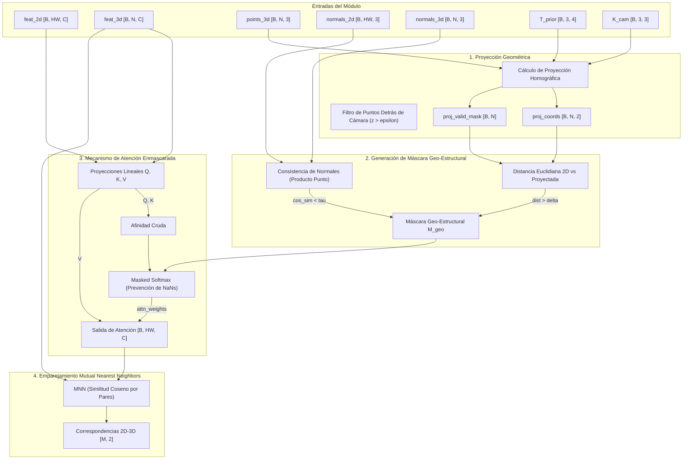

# Plan de Implementación Técnica y Conceptual: Atención Cruzada Estructural (GSCA) y Matching MNN

Este documento presenta el plan de diseño e implementación del módulo **Geo-Structural Cross-Attention (GSCA)** y el algoritmo de emparejamiento **Mutual Nearest Neighbors (MNN)**. Este módulo constituye el núcleo de alineamiento inter-dominio 2D-3D en la arquitectura de estimación de pose para afloramientos geológicos.

---

## 1. Propósito y Contexto Arquitectónico

El módulo GSCA actúa como un puente de correspondencia métrica y conceptual entre dos dominios de representación físicamente asimétricos:
* **Dominio Visual 2D (Consultas / Queries)**: Descriptores densos de textura y semántica geológica extraídos por la rama DINOv2 adaptada.
* **Dominio Geométrico 3D (Claves y Valores / Keys y Values)**: Descriptores locales y topológicos extraídos de la nube de puntos por DGCNN (EdgeConv multi-escala).

### El Desafío Geológico
Los afloramientos de roca presentan patrones visuales altamente repetitivos (estratos sedimentarios cíclicos, fracturas paralelas). Una atención cruzada global pura sufriría de ambigüedad severa. 

### La Solución GSCA
GSCA mitiga esto guiando el cálculo de afinidades atencionales mediante la **certidumbre geométrica**. Utilizando un prior de pose de cámara ($\mathbf{T}_{prior}$) y la calibración intrínseca ($\mathbf{K}_{cam}$), proyecta la nube de puntos en el plano de la imagen. La atención se restringe mediante una máscara geo-estructural ($\mathbf{M}_{geo}$) que anula la comunicación entre píxeles y puntos 3D si:
1. Están físicamente distantes en la proyección de la imagen (más allá de un radio de tolerancia $\delta$).
2. Sus orientaciones superficiales (normales 2D y normales 3D) son inconsistentes (menores a un umbral de coplanaridad $\tau$).

Finalmente, los descriptores visuales refinados por contexto geométrico se emparejan con los descriptores 3D mediante **MNN**, sirviendo como correspondencias directas para el estimador de pose PnP + RANSAC.



---

## 2. Especificación Estricta de Interfaces

### A. Proyección de la Nube de Puntos (`project_points`)
Este método auxiliar proyecta físicamente la nube de puntos 3D al plano del sensor de la cámara y filtra aquellos puntos que no se encuentren en el campo de visión frontal del sensor.

* **Entradas**:
  * `points_3d` (`torch.Tensor`):
    * **Dimensiones**: `[B, N, 3]` (donde `B` es el tamaño del lote, `N` el número de puntos en la nube).
    * **Tipo de datos**: `torch.float32`.
    * **Rango**: Coordenadas espaciales métricas del modelo global (e.g., $[-1000.0, 1000.0]$ metros).
  * `K_cam` (`torch.Tensor`):
    * **Dimensiones**: `[B, 3, 3]`. Matriz intrínseca de calibración de la cámara.
    * **Tipo de datos**: `torch.float32`.
  * `R_prior` (`torch.Tensor`):
    * **Dimensiones**: `[B, 3, 3]`. Matriz de rotación estimada de la pose previa en $SO(3)$.
    * **Tipo de datos**: `torch.float32`.
  * `t_prior` (`torch.Tensor`):
    * **Dimensiones**: `[B, 3, 1]` o `[B, 3]`. Vector de traslación estimado del prior de pose.
    * **Tipo de datos**: `torch.float32`.
  * `near_plane` (`float`, opcional):
    * Umbral del plano de recorte cercano para filtrar puntos detrás de la cámara.
    * **Valor por defecto**: `0.1` (metros).

* **Salidas**:
  * `proj_coords` (`torch.Tensor`):
    * **Dimensiones**: `[B, N, 2]`. Coordenadas proyectadas de píxel $(u_j, v_j)$ en la imagen 2D.
    * **Tipo de datos**: `torch.float32`.
  * `proj_valid_mask` (`torch.Tensor`):
    * **Dimensiones**: `[B, N]`. Máscara booleana que es `True` si el punto 3D está ubicado delante de la cámara ($z_{camera} > \text{near\_plane}$).
    * **Tipo de datos**: `torch.bool`.

---

### B. Módulo de Atención Cruzada (`GeoStructuralCrossAttention.forward`)
Lleva a cabo la proyección lineal de los descriptores visuales y geométricos, construye la máscara geo-estructural combinada $\mathbf{M}_{geo}$, realiza la atención cruzada regulada con control numérico y retorna los descriptores visuales refinados.

* **Entradas**:
  * `feat_2d` (`torch.Tensor`):
    * **Dimensiones**: `[B, HW, C]` (donde `HW` es el número de píxeles/posiciones espaciales y `C` la dimensión del canal latente común $\mathcal{Z}$).
    * **Tipo de datos**: `torch.float32`.
  * `feat_3d` (`torch.Tensor`):
    * **Dimensiones**: `[B, N, C]`. Descriptores geométricos.
    * **Tipo de datos**: `torch.float32`.
  * `coords_2d` (`torch.Tensor`):
    * **Dimensiones**: `[B, HW, 2]`. Coordenadas de píxel reales $(u_i, v_i)$ correspondientes a las posiciones en `feat_2d`.
    * **Tipo de datos**: `torch.float32`.
  * `proj_coords` (`torch.Tensor`):
    * **Dimensiones**: `[B, N, 2]`. Coordenadas de píxel proyectadas del modelo 3D.
    * **Tipo de datos**: `torch.float32`.
  * `proj_valid_mask` (`torch.Tensor`):
    * **Dimensiones**: `[B, N]`. Máscara booleana de puntos válidos en el frente de cámara.
    * **Tipo de datos**: `torch.bool`.
  * `normals_2d` (`torch.Tensor`):
    * **Dimensiones**: `[B, HW, 3]`. Vectores normales unitarios estimados en el espacio 2D.
    * **Tipo de datos**: `torch.float32`.
    * **Rango**: $[-1.0, 1.0]$ con norma $\|\mathbf{n}_i\|_2 = 1.0$.
  * `normals_3d` (`torch.Tensor`):
    * **Dimensiones**: `[B, N, 3]`. Vectores normales unitarios de la nube de puntos 3D.
    * **Tipo de datos**: `torch.float32`.
    * **Rango**: $[-1.0, 1.0]$ con norma $\|\mathbf{n}_j\|_2 = 1.0$.
  * `delta` (`float`):
    * Umbral del radio de búsqueda geométrica local en píxeles.
    * **Rango**: $> 0.0$ (por ejemplo, `30.0` píxeles).
  * `tau` (`float`):
    * Umbral mínimo de similitud de normales (coplanaidad).
    * **Rango**: $[-1.0, 1.0]$ (por ejemplo, `0.5`).

* **Salidas**:
  * `refined_feat_2d` (`torch.Tensor`):
    * **Dimensiones**: `[B, HW, C]`. Descriptores visuales 2D refinados mediante el contexto geométrico 3D compatible.
    * **Tipo de datos**: `torch.float32`.

---

### C. Matching Mutual Nearest Neighbors (`compute_mnn_matches`)
Encuentra correspondencias biunívocas (mutuas) entre descriptores 2D y descriptores 3D filtrando asociaciones de baja confianza.

* **Entradas**:
  * `feat_2d` (`torch.Tensor`):
    * **Dimensiones**: `[HW, C]`. Descriptores visuales refinados (para una muestra de imagen individual).
    * **Tipo de datos**: `torch.float32`.
  * `feat_3d` (`torch.Tensor`):
    * **Dimensiones**: `[N, C]`. Descriptores geométricos.
    * **Tipo de datos**: `torch.float32`.
  * `sim_threshold` (`float`, opcional):
    * Umbral de similitud coseno mínima requerida para consolidar una correspondencia.
    * **Valor por defecto**: `0.2`.

* **Salidas**:
  * `matches` (`torch.Tensor`):
    * **Dimensiones**: `[M, 2]` (donde `M` es el número total de emparejamientos mutuos que superan el umbral). La primera columna contiene los índices locales de píxeles 2D ($[0, HW-1]$) y la segunda columna contiene los índices de puntos 3D ($[0, N-1]$).
    * **Tipo de datos**: `torch.int64`.
  * `match_scores` (`torch.Tensor`):
    * **Dimensiones**: `[M]`. Valores de similitud coseno asociados a cada emparejamiento.
    * **Tipo de datos**: `torch.float32`.
    * **Rango**: $[sim\_threshold, 1.0]$.

---

## 3. Flujo Lógico y Pseudocódigo

El flujo lógico del módulo integra la proyección del prior de pose, el cálculo y combinación de máscaras y la mitigación de NaNs numéricos en el softmax para consultas sin vecinos geométricos válidos.

### Pseudocódigo Detallado

```python
# ==============================================================================
# Algoritmo de Proyección Geométrica
# ==============================================================================
Función project_points(points_3d, K_cam, R_prior, t_prior, near_plane=0.1):
    # points_3d: [B, N, 3]
    # K_cam: [B, 3, 3]
    # R_prior: [B, 3, 3]
    # t_prior: [B, 3] o [B, 3, 1]
    
    Asegurar que t_prior tenga forma [B, 3, 1]
    
    # 1. Transformar puntos 3D al sistema de coordenadas de la cámara
    # p_cam = R_prior @ points_3d^T + t_prior
    points_3d_t = Transponer points_3d en dimensiones (1, 2) # [B, 3, N]
    points_cam = bmm(R_prior, points_3d_t) + t_prior # [B, 3, N]
    
    # 2. Extraer profundidad del punto en el plano de la cámara (coordenada z)
    depth = points_cam[:, 2, :] # [B, N]
    
    # 3. Crear máscara de puntos válidos (frente a la cámara)
    proj_valid_mask = depth > near_plane # [B, N] (Boolean Tensor)
    
    # Evitar división por cero o por valores negativos extremadamente pequeños
    depth_safe = Determinar donde depth <= near_plane y rellenar con near_plane
    
    # 4. Proyección de perspectiva homogénea
    # K_cam @ points_cam / depth
    projected = bmm(K_cam, points_cam) # [B, 3, N]
    proj_coords_u = projected[:, 0, :] / depth_safe # [B, N]
    proj_coords_v = projected[:, 1, :] / depth_safe # [B, N]
    
    proj_coords = Concatenar(proj_coords_u, proj_coords_v) a lo largo de la dimensión -1 # [B, N, 2]
    
    Retornar proj_coords, proj_valid_mask


# ==============================================================================
# Algoritmo Principal de Atención Cruzada Estructural GSCA
# ==============================================================================
Clase GeoStructuralCrossAttention(nn.Module):
    Inicializar(channels):
        Super().Inicializar()
        scale = sqrt(channels)
        q_proj = Capa Lineal(channels, channels)
        k_proj = Capa Lineal(channels, channels)
        v_proj = Capa Lineal(channels, channels)
        
    Función forward(feat_2d, feat_3d, coords_2d, proj_coords, proj_valid_mask, 
                    normals_2d, normals_3d, delta=30.0, tau=0.5):
        # 1. Proyecciones Lineales
        Q = q_proj(feat_2d)  # [B, HW, C]
        K = k_proj(feat_3d)  # [B, N, C]
        V = v_proj(feat_3d)  # [B, N, C]
        
        # 2. Similitud visual-geométrica cruda
        attn_logits = bmm(Q, K^T) / scale  # [B, HW, N]
        
        # 3. Construcción de Máscara Geo-Estructural M_geo
        # 3.1 Distancia euclidiana proyectada en 2D
        # coords_2d: [B, HW, 2], proj_coords: [B, N, 2]
        dist = cdist(coords_2d, proj_coords, p=2)  # [B, HW, N]
        dist_mask = dist > delta  # [B, HW, N]
        
        # 3.2 Producto punto de normales 2D-3D (Coplanaidad)
        # Asegurar normales normalizadas L2
        n2d_norm = L2_Normalize(normals_2d, dim=-1) # [B, HW, 3]
        n3d_norm = L2_Normalize(normals_3d, dim=-1) # [B, N, 3]
        cos_normal = bmm(n2d_norm, n3d_norm^T)      # [B, HW, N]
        normal_mask = cos_normal < tau  # [B, HW, N]
        
        # 3.3 Combinar filtros geométricos y validez de la profundidad
        # Invalidar puntos si:
        # - Superan el radio delta en 2D (dist_mask) OR
        # - Su alineamiento de normales es inferior a tau (normal_mask) OR
        # - El punto 3D está ubicado detrás de la cámara (~proj_valid_mask)
        invalid_mask = dist_mask | normal_mask | (~proj_valid_mask.unsqueeze(1)) # [B, HW, N]
        
        # 3.4 Creación de m_geo con penalización estricta (-inf)
        m_geo = Generar matriz de ceros similar a attn_logits
        m_geo[invalid_mask] = -1e9  # Usar un valor numérico seguro en lugar de -float('inf')
        
        # 4. Mitigación de NaNs en Softmax
        # Si una consulta visual 2D (píxel i) no posee ningún punto 3D compatible, 
        # toda su fila en m_geo será -1e9, provocando NaNs al calcular softmax.
        all_invalid = invalid_mask.all(dim=-1)  # [B, HW]
        
        # Para evitar el colapso numérico, para las filas totalmente inválidas 
        # desactivamos la máscara (se les asigna 0) para que el softmax resulte en
        # una distribución uniforme, y luego anularemos su salida.
        m_geo = Donde(all_invalid.unsqueeze(-1), 0.0, m_geo)
        
        # 5. Cálculo del Softmax Enmascarado
        attn_weights = Softmax(attn_logits + m_geo, dim=-1)  # [B, HW, N]
        
        # 6. Agregación y Salida
        out = bmm(attn_weights, V)  # [B, HW, C]
        
        # Anular la salida para consultas visuales sin correspondencias geométricas válidas
        out = out * (~all_invalid).unsqueeze(-1).float()
        
        # Conexión residual entrenable opcional (preserva el descriptor visual original)
        # out = feat_2d + out
        
        Retornar out


# ==============================================================================
# Algoritmo de Emparejamiento MNN con Umbral
# ==============================================================================
Función compute_mnn_matches(feat_2d, feat_3d, sim_threshold=0.2):
    # feat_2d: [HW, C]
    # feat_3d: [N, C]
    
    # 1. Normalizar L2 para similitud coseno pura
    feat_2d_norm = L2_Normalize(feat_2d, dim=-1)
    feat_3d_norm = L2_Normalize(feat_3d, dim=-1)
    
    # 2. Matriz de afinidad coseno completa
    sim_matrix = mm(feat_2d_norm, feat_3d_norm^T)  # [HW, N]
    
    # 3. Búsqueda bidireccional
    nn_2d_to_3d = argmax(sim_matrix, dim=1)  # [HW] (índice 3D óptimo para cada 2D)
    nn_3d_to_2d = argmax(sim_matrix, dim=0)  # [N]  (índice 2D óptimo para cada 3D)
    
    # 4. Condición de reciprocidad (Mutualidad)
    indices_2d = Rango(0, HW)
    mnn_mask = (nn_3d_to_2d[nn_2d_to_3d] == indices_2d) # [HW] (Booleano)
    
    # 5. Aplicar umbral de similitud mínima para descartar correspondencias aleatorias
    best_similarities = sim_matrix[indices_2d, nn_2d_to_3d] # [HW]
    threshold_mask = best_similarities >= sim_threshold
    
    final_mask = mnn_mask & threshold_mask # [HW]
    
    # 6. Empaquetar correspondencias
    matches_2d = indices_2d[final_mask]
    matches_3d = nn_2d_to_3d[final_mask]
    match_scores = best_similarities[final_mask]
    
    matches = Stack([matches_2d, matches_3d], dim=1) # [M, 2]
    
    Retornar matches, match_scores
```

---

## 4. Dependencias del Módulo

El módulo se diseñará para ser autosuficiente y eficiente, basándose únicamente en el ecosistema de PyTorch para garantizar retrocompatibilidad y una integración directa en dispositivos GPU/CUDA.

* **Biblioteca Principal**: `torch` (versión $\ge 2.0.0$ recomendada para utilizar operadores vectorizados de `cdist` optimizados).
* **Biblioteca de Redes Neuronales**: `torch.nn` (para las proyecciones lineales `nn.Linear`).
* **Librerías Auxiliares (Solo para Pruebas/Validación)**:
  * `pytest`: Para la suite estructurada de pruebas unitarias.
  * `numpy`: Para la generación y validación de matrices de rotación sintéticas (mediante fórmulas de Rodrigues u operaciones SO(3)).

> [!NOTE]
> Aunque las otras ramas del proyecto utilizan `PyTorch Geometric (PyG)`, este módulo específico de atención cruzada opera sobre tensores densos intermedios y no requiere dependencias de grafos directas en su ejecución, optimizando el ancho de banda de cómputo en la GPU.

---

## 5. Estrategia y Diseño de Pruebas Unitarias

Para validar este módulo de forma aislada se implementará una suite de pruebas con `pytest` que cubrirá tanto las especificaciones de dimensiones (shapes) como las restricciones físicas y de estabilidad numérica del flujo de datos.

### Casos de Prueba Diseñados

#### 1. Prueba de Consistencia de Dimensiones (Shape Test)
* **Objetivo**: Asegurar que las dimensiones de salida coincidan exactamente con la especificación bajo un lote arbitrario $B > 1$.
* **Entradas**: Tensores generados de forma aleatoria con las dimensiones indicadas en la sección de interfaces (`feat_2d=[2, 100, 128]`, `feat_3d=[2, 150, 128]`, etc.).
* **Aserción**: La salida de `GeoStructuralCrossAttention` debe tener dimensiones idénticas a `feat_2d` (`[2, 100, 128]`).

#### 2. Prueba del Filtro de Distancia Proyectada ($\delta$)
* **Objetivo**: Validar que la máscara geo-estructural anule efectivamente a los puntos 3D que están fuera del radio de tolerancia $\delta$ en píxeles.
* **Entradas**:
  * Un píxel $i$ en coordenadas `[0.0, 0.0]`.
  * Dos puntos proyectados: punto A en `[10.0, 0.0]` y punto B en `[100.0, 0.0]`.
  * Configurar `delta = 30.0` (de modo que el punto A sea válido y el B sea inválido).
* **Aserción**: El peso de atención asignado al punto B en la matriz `attn_weights` para el píxel $i$ debe ser exactamente $0.0$, demostrando que se ha aislado del cálculo.

#### 3. Prueba de Consistencia de Orientación y Coplanaidad ($\tau$)
* **Objetivo**: Verificar que las normales que no coinciden en su orientación sean enmascaradas.
* **Entradas**:
  * Un píxel con normal 2D $[0, 0, 1]^T$.
  * Dos puntos 3D con normales $[0, 0, 1]^T$ (paralelo, sim = 1.0) y $[0, 0, -1]^T$ (antiparalelo, sim = -1.0).
  * Umbral $\tau = 0.5$.
* **Aserción**: La normal antiparalela debe ser enmascarada y poseer un peso de atención final de $0.0$.

#### 4. Prueba de Estabilidad Numérica y Prevención de NaNs
* **Objetivo**: Verificar que la atención no explote ni devuelva `NaN` cuando todas las llaves 3D son invalidadas por la máscara física de un píxel.
* **Entradas**: Píxeles 2D con coordenadas distantes a más de $500$ píxeles de cualquier punto proyectado 3D, de modo que `invalid_mask` resulte en `True` para toda la fila.
* **Aserción**: La salida de atención no debe contener valores `NaN` o `Inf`, y el vector resultante para esa fila debe ser exactamente el vector nulo $[0, 0, ..., 0]^T$.

#### 5. Prueba de Puntos Detrás de la Cámara
* **Objetivo**: Validar el correcto filtrado de la proyección para puntos con coordenadas de profundidad $z_{cam} \le 0$ o menores al plano cercano.
* **Entradas**: Un punto 3D ubicado físicamente detrás del plano de la cámara (por ejemplo, a $-5.0$ metros del centro de proyección de la cámara).
* **Aserción**: El método `project_points` debe retornar un indicador de máscara booleana `proj_valid_mask` igual a `False` para dicho punto, y este punto no debe influenciar a ningún descriptor 2D en la atención cruzada.

#### 6. Prueba de Correspondencias MNN y Umbralización
* **Objetivo**: Validar que `compute_mnn_matches` devuelva correspondencias que sean estrictamente recíprocas y que superen el umbral mínimo de similitud.
* **Entradas**: Descriptores visuales y geométricos sintéticos con emparejamientos predeterminados conocidos (por ejemplo, pares idénticos pero con ruidos controlados).
* **Aserción**:
  * Solo se deben reportar índices recíprocos en `matches`.
  * Ningún emparejamiento con similitud coseno menor a `sim_threshold` debe aparecer en el resultado final.

#### 7. Prueba de Flujo de Gradientes (Backpropagation)
* **Objetivo**: Garantizar que el módulo es completamente diferenciable con respecto a las características de entrada, permitiendo el aprendizaje de extremo a extremo (end-to-end).
* **Entradas**: Inicializar tensores de entrada con `requires_grad=True` para `feat_2d` y `feat_3d`. Realizar una pasada hacia adelante por la atención cruzada y calcular una pérdida simple (e.g. la suma del tensor de salida).
* **Aserción**: El método `backward()` debe ejecutarse correctamente sin errores de grafo no-diferenciable, y los gradientes `.grad` de `feat_2d` y `feat_3d` deben estar poblados con valores reales no nulos.

---

## 6. Siguientes Pasos y Cronograma de Trabajo

1. **Codificación de Componentes**: Implementar las firmas y clases en el módulo `gsca_matcher.py`.
2. **Implementación de Tests**: Crear la suite de pytest en `test_gsca_matcher.py` y resolver las fallas de estabilidad numérica identificadas.
3. **Optimización CUDA**: Vectorizar las llamadas homográficas y las operaciones de `cdist` en la GPU.
4. **Integración con Circle Loss**: Acoplar la salida con el bucle de entrenamiento y la función de pérdida Circle Loss adaptativa para calibrar los Visual Adapters y DGCNN.
