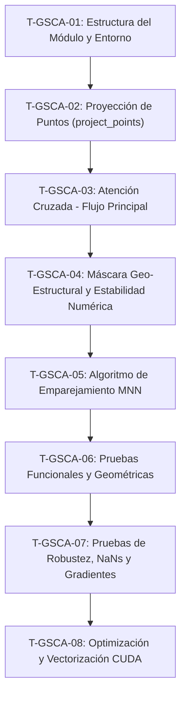

# Lista de Tareas Estructuradas: Atención Cruzada Estructural (GSCA) y Matching MNN

Este documento contiene la lista detallada y secuencial de tareas atómicas para la implementación del módulo **Geo-Structural Cross-Attention (GSCA)** y el algoritmo de emparejamiento **Mutual Nearest Neighbors (MNN)**. Está diseñado bajo el enfoque de desarrollo guiado por requisitos y pruebas de robustez numérica y geométrica.

---

## Diagrama de Secuencia de Tareas

---

## Desglose de Tareas Atómicas

### T-GSCA-01: Estructura del Módulo y Entorno
* **ID de la Tarea**: `T-GSCA-01`
* **Título**: Estructura del Módulo y Entorno de Trabajo
* **Descripción detallada**:
  Crear los archivos fuente vacíos para el código del módulo (`gsca_matcher.py`) y la suite de pruebas unitarias (`test_gsca_matcher.py`). Definir las dependencias base en los archivos de configuración del proyecto y declarar los esqueletos de las funciones y clases principales con sus tipos y firmas exactas, sin lógica de negocio (usando `raise NotImplementedError` o `pass`).
* **Requisitos técnicos duros**:
  * **Ubicación de archivos**:
    * Código: `/home/mrepetto/Documentos/GSCA/src/gsca_matcher.py` (o estructura análoga en `src/`).
    * Pruebas: `/home/mrepetto/Documentos/GSCA/tests/test_gsca_matcher.py` (o estructura análoga en `tests/`).
  * **Firmas de métodos exactas**:
    * `def project_points(points_3d: torch.Tensor, K_cam: torch.Tensor, R_prior: torch.Tensor, t_prior: torch.Tensor, near_plane: float = 0.1) -> Tuple[torch.Tensor, torch.Tensor]:`
    * `class GeoStructuralCrossAttention(nn.Module):`
      * `def __init__(self, channels: int):`
      * `def forward(self, feat_2d: torch.Tensor, feat_3d: torch.Tensor, coords_2d: torch.Tensor, proj_coords: torch.Tensor, proj_valid_mask: torch.Tensor, normals_2d: torch.Tensor, normals_3d: torch.Tensor, delta: float = 30.0, tau: float = 0.5) -> torch.Tensor:`
    * `def compute_mnn_matches(feat_2d: torch.Tensor, feat_3d: torch.Tensor, sim_threshold: float = 0.2) -> Tuple[torch.Tensor, torch.Tensor]:`
  * **Dependencias**: El archivo debe importar únicamente `torch`, `torch.nn`, `torch.nn.functional` y las utilidades estándar de tipado de Python (`Tuple`, `Union`).
* **Criterios de aceptación**:
  * Los dos archivos deben existir en las rutas correctas.
  * El código del esqueleto debe compilar sin errores de sintaxis en un entorno Python $\ge 3.8$ con PyTorch $\ge 2.0.0$.
  * Ejecutar `pytest tests/test_gsca_matcher.py` debe descubrir las pruebas declaradas (deberían reportar fallo controlado o estado de salto).

---

### T-GSCA-02: Proyección de Puntos (project_points)
* **ID de la Tarea**: `T-GSCA-02`
* **Título**: Implementación del Algoritmo de Proyección Homográfica y Filtro de Profundidad
* **Descripción detallada**:
  Implementar la transformación matemática de coordenadas 3D de la nube de puntos al sistema de coordenadas de la cámara utilizando la pose del prior (rotación y traslación). A partir de esto, proyectar las coordenadas en el espacio continuo del sensor de la cámara (píxeles 2D) usando la matriz intrínseca. Filtrar los puntos situados detrás de la cámara o muy cercanos a la lente empleando el parámetro `near_plane`.
* **Requisitos técnicos duros**:
  * **Tipos y dimensiones de entrada**:
    * `points_3d`: `torch.Tensor` de forma `[B, N, 3]`, tipo `torch.float32`.
    * `K_cam`: `torch.Tensor` de forma `[B, 3, 3]`, tipo `torch.float32`.
    * `R_prior`: `torch.Tensor` de forma `[B, 3, 3]`, tipo `torch.float32`.
    * `t_prior`: `torch.Tensor` de forma `[B, 3, 1]` o `[B, 3]`, tipo `torch.float32`.
    * `near_plane`: `float` estrictamente positivo (default = `0.1`).
  * **Procesamiento interno**:
    * Forzar dimensionalidad de `t_prior` a `[B, 3, 1]`.
    * Transformación de coordenadas de cámara: `points_cam = torch.bmm(R_prior, points_3d.transpose(1, 2)) + t_prior` (forma resultante: `[B, 3, N]`).
    * Profundidad $z = \text{points\_cam}[:, 2, :]$ (forma: `[B, N]`).
    * Máscara booleana: `proj_valid_mask = depth > near_plane` (forma: `[B, N]`).
    * Evitar divisiones indeterminadas: Reemplazar valores de `depth` menores o iguales a `near_plane` por `near_plane` (o un valor seguro mayor a cero) antes de normalizar las coordenadas homogéneas.
    * Proyección homogénea: `projected = torch.bmm(K_cam, points_cam)`. Coordenadas de salida: `u = projected[:, 0, :] / depth_safe`, `v = projected[:, 1, :] / depth_safe`.
  * **Tipos y dimensiones de salida**:
    * `proj_coords`: `torch.Tensor` de forma `[B, N, 2]`, tipo `torch.float32`.
    * `proj_valid_mask`: `torch.Tensor` de forma `[B, N]`, tipo `torch.bool`.
* **Criterios de aceptación**:
  * Para una entrada sintética donde la nube tiene puntos con coordenada Z en el plano de la cámara igual a $-1.0$, `proj_valid_mask` para ese punto debe ser estrictamente `False`.
  * La proyección de un punto conocido a través de una traslación pura y una calibración de cámara identidad debe coincidir exactamente con el cálculo analítico manual en precisión de coma flotante de simple precisión.

---

### T-GSCA-03: Atención Cruzada - Flujo Principal
* **ID de la Tarea**: `T-GSCA-03`
* **Título**: Implementación del Mecanismo de Proyección Lineal y Afinidades de Atención Cruzada
* **Descripción detallada**:
  Implementar la inicialización y el flujo de alimentación (forward pass) de las proyecciones lineales Query, Key y Value a partir de los descriptores 2D y 3D. Calcular la matriz de similitud cruda utilizando el producto punto escalado entre los embeddings proyectados.
* **Requisitos técnicos duros**:
  * **Constructor**:
    * Inicializar tres capas `nn.Linear(channels, channels, bias=True)` (o `bias=False` según diseño común de atención) mapeando de la dimensión `channels` a `channels`.
    * Definir el factor de escala flotante `scale = math.sqrt(channels)`.
  * **Tipos y dimensiones de entrada (`forward`)**:
    * `feat_2d`: `torch.Tensor` de forma `[B, HW, C]`, tipo `torch.float32`.
    * `feat_3d`: `torch.Tensor` de forma `[B, N, C]`, tipo `torch.float32`.
  * **Procesamiento interno**:
    * Proyecciones: $Q = \text{q\_proj}(feat\_2d)$ (`[B, HW, C]`), $K = \text{k\_proj}(feat\_3d)$ (`[B, N, C]`), $V = \text{v\_proj}(feat\_3d)$ (`[B, N, C]`).
    * Afinidad cruda: `attn_logits = torch.bmm(Q, K.transpose(1, 2)) / scale` (forma: `[B, HW, N]`).
* **Criterios de aceptación**:
  * La matriz `attn_logits` intermedia debe ser computada sin bucles explícitos sobre el lote `B`.
  * La salida intermedia `attn_logits` debe tener exactamente la forma tridimensional `[B, HW, N]`.

---

### T-GSCA-04: Máscara Geo-Estructural y Estabilidad Numérica
* **ID de la Tarea**: `T-GSCA-04`
* **Título**: Construcción de Máscaras Geo-Estructurales y Mitigación de Pérdida de Gradientes/NaNs
* **Descripción detallada**:
  Implementar la construcción de la máscara $M_{geo}$ que evalúa por pares la distancia espacial 2D proyectada (tolerancia $\delta$) y la coherencia de normales (similitud $\tau$). Integrar la máscara de profundidad válida. Diseñar la lógica de control para evitar la generación de `NaN` en la función Softmax cuando una consulta 2D es completamente descartada por los filtros geométricos, forzando la distribución a ser uniforme y el descriptor resultante a ser nulo.
* **Requisitos técnicos duros**:
  * **Entradas**:
    * `coords_2d`: `[B, HW, 2]`, `proj_coords`: `[B, N, 2]`, `proj_valid_mask`: `[B, N]` (bool).
    * `normals_2d`: `[B, HW, 3]` (normales unitarias), `normals_3d`: `[B, N, 3]` (normales unitarias).
    * `delta`: `float` ($>0.0$), `tau`: `float` (rango $[-1.0, 1.0]$).
  * **Cálculo de Máscaras**:
    * Distancia 2D: `dist = torch.cdist(coords_2d, proj_coords, p=2.0)` (forma: `[B, HW, N]`). Máscara: `dist_mask = dist > delta`.
    * Coplanaidad (Normales): Asegurar normalización L2 unitaria de `normals_2d` y `normals_3d` sobre el canal 2. Matriz de consistencia: `cos_normal = torch.bmm(n2d_norm, n3d_norm.transpose(1, 2))` (forma: `[B, HW, N]`). Máscara: `normal_mask = cos_normal < tau`.
    * Combinar máscaras booleanas: `invalid_mask = dist_mask | normal_mask | (~proj_valid_mask.unsqueeze(1))` (forma: `[B, HW, N]`).
    * Aplicar penalización: Inicializar tensor de máscara `m_geo` con ceros. Rellenar las posiciones indicadas por `invalid_mask` con un valor estable de penalización como `-1e9`.
  * **Mitigación de NaNs en Softmax**:
    * Detectar filas totalmente inválidas: `all_invalid = invalid_mask.all(dim=-1)` (forma: `[B, HW]`).
    * En `m_geo`, reemplazar las filas completamente inválidas con `0.0` usando `torch.where` para evitar la indeterminación $-\infty - \infty$ o la división por cero en Softmax.
    * Calcular el softmax de atención: `attn_weights = torch.softmax(attn_logits + m_geo, dim=-1)`.
    * Agregación: `out = torch.bmm(attn_weights, V)` (forma: `[B, HW, C]`).
    * Post-anulación: `out = out * (~all_invalid).unsqueeze(-1).float()` para garantizar que los elementos totalmente inválidos devuelvan un descriptor de ceros.
* **Criterios de aceptación**:
  * Ninguna operación del flujo hacia adelante de `GeoStructuralCrossAttention` debe dar como resultado un tensor con elementos `NaN` o `Inf`, incluso si `invalid_mask` contiene filas que son 100% `True`.
  * Los pesos de atención asignados a cualquier punto espacial fuera del radio $\delta$ o con normales inconsistentes con respecto a un píxel deben ser numéricamente $0.0$ en `attn_weights`.

---

### T-GSCA-05: Algoritmo de Emparejamiento MNN
* **ID de la Tarea**: `T-GSCA-05`
* **Título**: Implementación del Emparejamiento Mutual Nearest Neighbors (MNN) con Umbral
* **Descripción detallada**:
  Implementar la lógica para hallar correspondencias biunívocas discretas entre los descriptores visuales 2D refinados y los descriptores 3D. El algoritmo debe normalizar las características para usar similitud coseno pura, aplicar la reciprocidad de vecindario más cercano en ambas direcciones y aplicar un filtro de confianza mínimo según el umbral `sim_threshold`.
* **Requisitos técnicos duros**:
  * **Tipos y dimensiones de entrada**:
    * `feat_2d`: `torch.Tensor` de forma `[HW, C]`, tipo `torch.float32` (correspondiente a una única muestra del lote).
    * `feat_3d`: `torch.Tensor` de forma `[N, C]`, tipo `torch.float32`.
    * `sim_threshold`: `float` en el rango $[0.0, 1.0]$.
  * **Procesamiento interno**:
    * Normalización L2: `feat_2d_norm = F.normalize(feat_2d, p=2, dim=-1)` y `feat_3d_norm = F.normalize(feat_3d, p=2, dim=-1)`.
    * Similitud: `sim_matrix = torch.mm(feat_2d_norm, feat_3d_norm.transpose(0, 1))` (forma: `[HW, N]`).
    * Búsqueda mutua:
      * Vecino de 2D a 3D: `nn_2d_to_3d = torch.argmax(sim_matrix, dim=1)` (`[HW]`).
      * Vecino de 3D a 2D: `nn_3d_to_2d = torch.argmax(sim_matrix, dim=0)` (`[N]`).
      * Consistencia recíproca: `mnn_mask = nn_3d_to_2d[nn_2d_to_3d] == torch.arange(HW, device=feat_2d.device)`.
    * Filtro de umbral: `best_sim = sim_matrix[torch.arange(HW), nn_2d_to_3d]`. La máscara final es `final_mask = mnn_mask & (best_sim >= sim_threshold)`.
    * Apilamiento de índices de correspondencias: `matches = torch.stack([torch.arange(HW, device=feat_2d.device)[final_mask], nn_2d_to_3d[final_mask]], dim=1)`.
  * **Tipos y dimensiones de salida**:
    * `matches`: `torch.Tensor` de forma `[M, 2]`, tipo `torch.int64`, donde `matches[:, 0]` contiene los índices de píxel 2D y `matches[:, 1]` contiene los índices de puntos 3D.
    * `match_scores`: `torch.Tensor` de forma `[M]`, tipo `torch.float32`.
* **Criterios de aceptación**:
  * Si un par $(i, j)$ está presente en la salida `matches`, se debe verificar que `nn_2d_to_3d[i] == j` y `nn_3d_to_2d[j] == i`.
  * Ninguna similitud de emparejamiento devuelta en `match_scores` debe ser estrictamente menor que `sim_threshold`.

---

### T-GSCA-06: Pruebas Funcionales y Geométricas
* **ID de la Tarea**: `T-GSCA-06`
* **Título**: Implementación de la Suite de Pruebas Unitarias de Funcionalidad y Proyección Geométrica
* **Descripción detallada**:
  Implementar en `test_gsca_matcher.py` las pruebas unitarias para garantizar el comportamiento esperado bajo condiciones físicas y de forma. Esto incluye validar las dimensiones resultantes y los filtros de cercanía por distancia 2D proyectada, desalineación de normales y puntos posicionados detrás del plano cercano del sensor de la cámara.
* **Requisitos técnicos duros**:
  * **Prueba de consistencia de dimensiones**:
    * Inicializar tensores aleatorios con formas consistentes (`feat_2d` de `[2, 100, 64]`, `feat_3d` de `[2, 150, 64]`, normales coherentes y matrices de calibración/pose).
    * Validar que la forma de la salida del módulo `GeoStructuralCrossAttention` sea exactamente `[2, 100, 64]`.
  * **Prueba del filtro de distancia 2D ($\delta$)**:
    * Píxel en `[0.0, 0.0]`. Punto proyectado A en `[15.0, 0.0]` y punto proyectado B en `[45.0, 0.0]`.
    * Parámetro `delta = 30.0`.
    * Verificar mediante aserciones de PyTest que el peso de atención asignado al punto B es estrictamente `0.0`.
  * **Prueba del filtro de normales ($\tau$)**:
    * Píxel con normal `[0, 0, 1]`. Punto A con normal `[0, 0, 1]` y punto B con normal `[0, 0, -1]`.
    * Parámetro `tau = 0.5`.
    * Verificar que el peso de atención asignado al punto B es estrictamente `0.0`.
  * **Prueba de recorte de la cámara (near_plane)**:
    * Punto 3D situado en coordenadas de cámara con profundidad $Z = -2.0$ metros (detrás de la cámara).
    * Validar que `proj_valid_mask` para ese punto sea `False` y no ejerza influencia en la atención.
* **Criterios de aceptación**:
  * Ejecutar `pytest tests/test_gsca_matcher.py` con el filtro específico de estas pruebas y obtener un estado del 100% de éxito.
  * Todas las aserciones de consistencia matemática deben resolverse con tolerancia numérica ($\approx 1e-6$).

---

### T-GSCA-07: Pruebas de Robustez, NaNs y Gradientes
* **ID de la Tarea**: `T-GSCA-07`
* **Título**: Implementación de la Suite de Pruebas de Estabilidad de Gradientes, NaNs y Algoritmo MNN
* **Descripción detallada**:
  Implementar pruebas que verifiquen el control de excepciones numéricas cuando los datos están completamente desalineados geométricamente y comprobar que el flujo de gradientes hacia atrás (backpropagation) no se interrumpa ni produzca resultados indefinidos (gradientes nulos o NaN). Validar también el comportamiento restrictivo del algoritmo MNN.
* **Requisitos técnicos duros**:
  * **Prueba de estabilidad y prevención de NaNs**:
    * Configurar un lote donde un píxel visual se encuentre a una distancia de $1000$ píxeles de cualquier punto 3D proyectado (provocando que el 100% de los elementos de su fila en la máscara geo-estructural sean marcados como inválidos).
    * Validar que no se generen valores `NaN` o `Inf` en la salida y que el vector del píxel en la salida de la atención cruzada sea un tensor con valor absoluto menor a `1e-7` (cero numérico).
  * **Prueba de MNN con umbral**:
    * Diseñar descriptores sintéticos unidireccionales y mutuos. Validar que la salida contenga únicamente los pares que tienen correspondencia recíproca.
    * Validar que se descarten todos los emparejamientos por debajo del umbral mínimo de similitud.
  * **Prueba de flujo de gradientes (Backpropagation)**:
    * Declarar `feat_2d` y `feat_3d` como tensores de PyTorch con `requires_grad=True`.
    * Realizar la pasada forward, calcular una pérdida escalar (como la suma de la salida) y ejecutar `.backward()`.
    * Verificar mediante aserciones que `.grad` en `feat_2d` y `feat_3d` contenga valores numéricos válidos (no nulos y distintos de `NaN`).
* **Criterios de aceptación**:
  * La ejecución de `pytest` sobre esta suite debe completarse satisfactoriamente sin warnings de gradientes desconectados.
  * El tiempo total de ejecución de la suite de pruebas unitarias implementada no debe exceder los 5 segundos en CPU.

---

### T-GSCA-08: Optimización y Vectorización CUDA
* **ID de la Tarea**: `T-GSCA-08`
* **Título**: Optimización de Operadores Vectorizados y Compatibilidad Multi-Dispositivo (CPU/CUDA)
* **Descripción detallada**:
  Revisar la implementación matemática para garantizar que todas las operaciones dentro de los módulos críticos sean nativas y paralelas en la GPU. Evitar copias de tensores implícitas a la CPU (`.numpy()`, `.item()`) durante la pasada forward del modelo para mantener la máxima eficiencia de ejecución.
* **Requisitos técnicos duros**:
  * **Eliminación de bucles explícitos**: No usar bucles `for` para iterar sobre la dimensión del lote ($B$), la dimensión espacial ($HW$) o el número de puntos ($N$).
  * **Compatibilidad de dispositivo**: Asegurar que todos los tensores generados internamente (tales como máscaras, rangos de índices y tensores auxiliares de relleno) utilicen dinámicamente `.to(device=feat_2d.device, dtype=...)` o se creen directamente usando la especificación `device=feat_2d.device`.
  * **Operadores optimizados**: Emplear preferiblemente `torch.cdist` para distancias espaciales y operaciones matriciales nativas de PyTorch que tengan kernels paralelos optimizados en CUDA.
* **Criterios de aceptación**:
  * Ejecutar el flujo de las pruebas unitarias parametrizando las entradas en el dispositivo `cuda` (si el hardware lo tiene habilitado) y comprobar que pasa sin lanzar excepciones de desajuste de dispositivo (`RuntimeError: Expected all tensors to be on the same device`).
  * La tasa de throughput del módulo GSCA (pasada forward) medida en GPU debe ser lineal con respecto a un incremento del tamaño del lote $B$.
