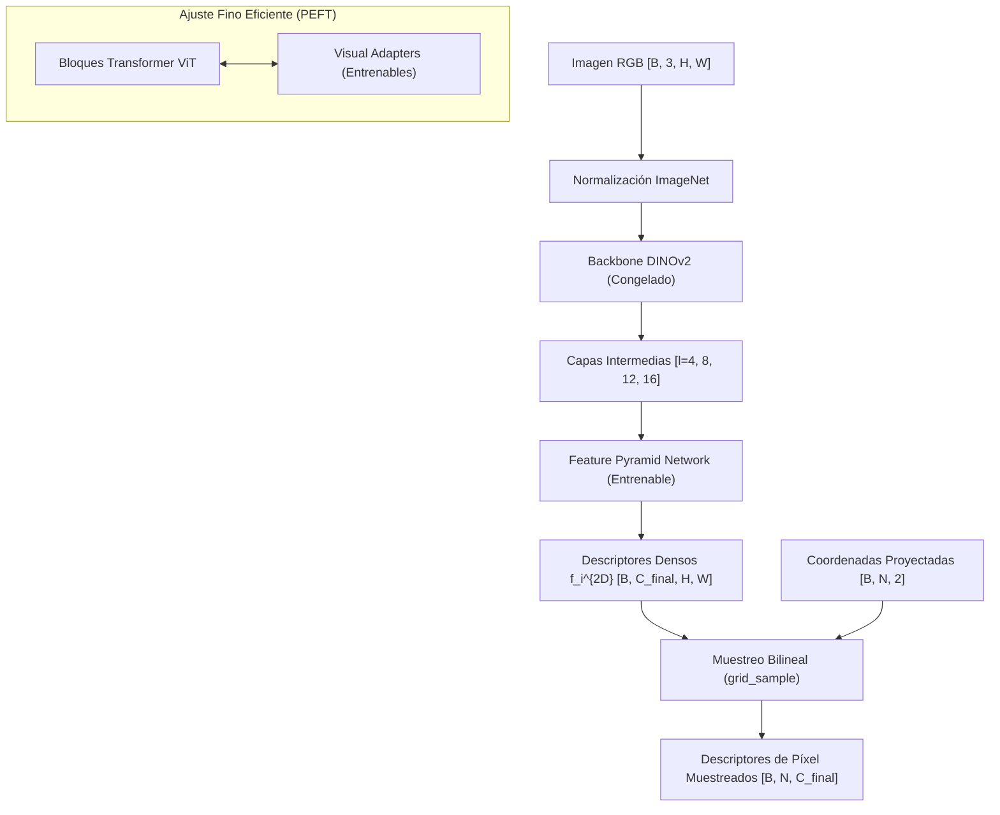

# Plan de Implementación: Rama Visual (2D) - Descriptores Semánticos Densos con DINOv2 y Adaptadores

Este documento presenta el plan de implementación detallado para la **Rama Visual (2D)** de la arquitectura **GSCA (Geo-Structural Cross-Attention)**. Este módulo se encarga de transformar imágenes RGB de afloramientos geológicos en mapas de descriptores visuales densos $\mathbf{f}_i^{2D}$ capaces de resistir la variabilidad extrema de la reflectancia y sombras bajo distintas condiciones de iluminación.

---

## 1. Propósito y Contexto del Módulo

En afloramientos geológicos, los métodos tradicionales de extracción de características basados en gradientes de brillo local (como SIFT o SuperPoint) fallan debido a la estocasticidad de la iluminación solar sobre la rugosidad de la roca (efectos BRDF). Para solucionar esto, este módulo adopta **DINOv2** como backbone debido a su comprensión semántica global y local inducida por el entrenamiento con iBOT (Masked Image Modeling).

Dado que DINOv2 tiende a enfocarse en bajas frecuencias espaciales (siluetas, formas globales) y los afloramientos geológicos requieren capturar alta frecuencia espacial (fallas, diaclasas, estratos), el módulo integra **Visual Adapters (PEFT)**. Estos adaptadores inyectan capas de cuello de botella (*bottleneck*) en paralelo a los MLP de cada bloque Transformer, manteniendo el backbone DINOv2 congelado.

Finalmente, dado que DINOv2 divide la imagen en parches de $14 \times 14$ píxeles perdiendo resolución espacial, se incorpora una **Feature Pyramid Network (FPN)** ligera o un decodificador tipo **Dense Prediction Transformer (DPT)**. Este decodificador combina activaciones multiescala del ViT para proyectar los descriptores de tokens nuevamente a la resolución original del píxel, facilitando un emparejamiento 2D-3D preciso en el Módulo de Atención Cruzada (GSCA).



---

## 2. Especificación Estricta de Interfaces

### 2.1 Tensores de Entrada

| Nombre | Forma | Tipo de Datos | Rango de Valores | Descripción |
| :--- | :--- | :--- | :--- | :--- |
| `images` | `[B, 3, H, W]` | `torch.float32` | `[0.0, 1.0]` o normalizado | Lote de imágenes RGB de entrada. Tanto `H` como `W` deben ser múltiplos de 14 (tamaño de parche de DINOv2). |
| `coords_2d` | `[B, N, 2]` | `torch.float32` | `[-1.0, 1.0]` (o en coordenadas de píxel `[0, W-1]`, `[0, H-1]`) | Coordenadas continuas 2D (p.ej. resultantes de proyectar la nube de puntos 3D a la pose de cámara aproximada) en las que se desea extraer descriptores. |

> [!NOTE]
> Para el preprocesamiento de `images`, se aplica la normalización estándar de ImageNet: media $\mu = [0.485, 0.456, 0.406]$ y desviación estándar $\sigma = [0.229, 0.224, 0.225]$.

### 2.2 Tensores de Salida

| Nombre | Forma | Tipo de Datos | Rango de Valores | Descripción |
| :--- | :--- | :--- | :--- | :--- |
| `dense_descriptors` | `[B, C_final, H, W]` | `torch.float32` | $\mathbb{R}$ (Normalización L2 opcional) | Mapa completo de descriptores densos a nivel de píxel generado por la FPN. |
| `sampled_descriptors` | `[B, N, C_final]` | `torch.float32` | $\mathbb{R}$ (Normalización L2 aplicada) | Descriptores visuales específicos extraídos de las coordenadas `coords_2d` usando interpolación bilineal. |

### 2.3 Parámetros Estáticos del Modelo

- `backbone_name`: Nombre del modelo DINOv2 a cargar (p.ej., `dinov2_vitb14` o `dinov2_vitl14`).
- `embed_dim` ($d$): Dimensión de embeddings del ViT (e.g., 768 para ViT-Base, 1024 para ViT-Large).
- `bottleneck_dim` ($r$): Dimensión del cuello de botella en los Visual Adapters (típicamente 64 o 128).
- `intermediate_layers`: Lista de índices de bloques de Transformer del ViT de los cuales extraer características (e.g., `[3, 6, 9, 12]` para ViT-Base, `[5, 11, 17, 23]` para ViT-Large).
- `out_dim` ($C_{final}$): Dimensión del descriptor final coincidente con el canal común de la rama geométrica 3D (típicamente 256).

---

## 3. Flujo Lógico Interno

El procesamiento del módulo se divide en tres componentes lógicos principales:

### Algoritmo 1: Inicialización y Envoltura PEFT de DINOv2
Este proceso prepara el backbone DINOv2 inyectando los `VisualAdapter` en paralelo al bloque MLP existente sin alterar los pesos preentrenados del ViT.

```
Procedimiento Inicializar_Rama_Visual_Con_PEFT(backbone_name, bottleneck_dim, intermediate_layers):
    1. Cargar backbone DINOv2 (congelado) desde torch.hub o HuggingFace Transformers.
    2. Para cada parámetro 'param' en backbone.parameters():
           param.requires_grad <- Falso
           
    3. Para cada índice 'idx' en intermediate_layers:
           bloque_original <- backbone.blocks[idx]
           embed_dim <- bloque_original.mlp.fc1.in_features
           
           # Crear VisualAdapter en paralelo
           adaptador <- Crear_Visual_Adapter(embed_dim, bottleneck_dim)
           
           # Inicializar pesos del adaptador
           Inicializar_Pesos_Cero(adaptador)
           
           # Envolver bloque original
           bloque_adaptado <- Envolver_Bloque(bloque_original, adaptador)
           backbone.blocks[idx] <- bloque_adaptado
           
    4. Crear decodificador FPN (Feature Pyramid Network) ligero y marcar sus parámetros como entrenables (requires_grad = Verdadero).
    5. Retornar modelo estructurado.
Fin Procedimiento
```

### Algoritmo 2: Pirámide de Características Artificial y FPN
DINOv2 produce mapas de características a resolución espacial constante (escala de parche $1/14$). Para construir la FPN, se genera una pirámide de características artificial mediante re-escalado convolucional.

```
Procedimiento Decodificar_FPN_Multiescala(features_list, target_shape):
    # features_list: lista de 4 tensores de tamaño [B, H_p * W_p, embed_dim]
    # donde H_p = H / 14, W_p = W / 14
    
    1. Reordenar y formatear cada tensor en features_list a forma espacial:
           F_i <- Reshape(features_list[i]) -> [B, embed_dim, H_p, W_p]
           
    2. Proyectar F_i a una dimensión uniforme de canales mediante convoluciones 1x1.
    
    3. Construir la Pirámide de Características Artificial aplicando proyecciones espaciales:
           - Escala 1 (1/4 de la resolución original): Convolución Transpuesta con stride 4 sobre F_0 -> P_1 [B, D, H/4, W/4]
           - Escala 2 (1/8 de la resolución original): Convolución Transpuesta con stride 2 sobre F_1 -> P_2 [B, D, H/8, W/8]
           - Escala 3 (1/14 de la resolución original): Identidad (mantener resolución nativa) sobre F_2 -> P_3 [B, D, H/14, W/14]
           - Escala 4 (1/28 de la resolución original): Convolución con stride 2 sobre F_3 -> P_4 [B, D, H/28, W/28]
           
    4. Fusión FPN descendente:
           - P_3_out <- P_3 + Upsample(P_4)
           - P_2_out <- P_2 + Upsample(P_3_out)
           - P_1_out <- P_1 + Upsample(P_2_out)
           
    5. Proyectar P_1_out a C_final canales y re-escalar al tamaño target [H, W] usando interpolación bilineal.
    6. Retornar dense_descriptors de forma [B, C_final, H, W].
Fin Procedimiento
```

### Algoritmo 3: Forward Pass y Muestreo de Descriptores
Para interactuar con la rama geométrica 3D, el módulo debe muestrear los descriptores densos 2D en las coordenadas proyectadas usando interpolación bilineal compatible con grafos de computación de gradientes.

```
Procedimiento Forward_Rama_Visual(images, coords_2d):
    1. Extraer features_list del backbone DINOv2 adaptado.
    2. dense_descriptors <- Decodificar_FPN_Multiescala(features_list, target_shape = images.shape[2:])
    
    3. Si coords_2d es provisto:
           # Normalizar coordenadas de pixeles a rango [-1, 1] si es necesario
           norm_coords <- Normalizar_Coordenadas(coords_2d, H, W) 
           
           # Muestreo bilineal mediante torch.nn.functional.grid_sample
           sampled_descriptors <- grid_sample(dense_descriptors, norm_coords) # [B, C_final, 1, N]
           sampled_descriptors <- Reshape(sampled_descriptors) -> [B, N, C_final]
           
           # Normalización L2 a nivel de descriptor para el espacio métrico común
           sampled_descriptors <- L2_Normalize(sampled_descriptors, dim=-1)
    
    4. Retornar dense_descriptors, sampled_descriptors
Fin Procedimiento
```

### Diseño del Visual Adapter y la Estabilidad de Inicialización
El bloque MLP adaptado sigue la siguiente formulación en el paso *forward*:
$$\mathbf{y} = \text{MLP}_{congelado}(\text{Norm}(\mathbf{x})) + \mathbf{W}_{up} \cdot \sigma(\mathbf{W}_{down} \cdot \text{Norm}(\mathbf{x}))$$
Para asegurar estabilidad al inicio del entrenamiento y prevenir la degradación de la representación latente de DINOv2, el peso $\mathbf{W}_{up}$ y su sesgo se inicializan con ceros. Al inicio:
$$\mathbf{W}_{up} = \mathbf{0} \implies \text{Adapter}(\mathbf{x}) = \mathbf{0}$$
Esto garantiza que en la primera iteración, la salida del transformador sea idéntica a la del modelo fundacional preentrenado.

---

## 4. Dependencias del Módulo

- **Librerías Core**:
  - `torch >= 2.0`: Motor de cálculo tensorial y diferenciación automática.
  - `torchvision >= 0.15`: Transformaciones e inicialización de imágenes.
- **Modelos Fundacionales**:
  - `urllib3`, `requests`: Para descarga de pesos de DINOv2 desde el hub oficial de PyTorch (`facebookresearch/dinov2`).
- **Librerías Auxiliares**:
  - `einops`: Para manipulación de tensores limpia y legible (reformateo de tokens a dimensiones espaciales 2D).

---

## 5. Estrategia y Diseño de Pruebas Unitarias

Para validar este módulo de forma aislada se plantean las siguientes pruebas automatizadas en `pytest`:

### 5.1 Test de Dimensiones de Entrada/Salida
- **Objetivo**: Garantizar que el flujo tensor sea consistente bajo diferentes dimensiones y tamaños de lote.
- **Condiciones**:
  - Entradas: Lotes de tamaño $B \in \{1, 4\}$ con imágenes de resoluciones $224\times224$ y $518\times518$ (múltiplos de 14).
  - Resultados Esperados: El mapa de descriptores densos debe mantener la resolución original de la imagen `[B, C_final, H, W]` y el descriptor muestreado debe coincidir con `[B, N, C_final]`.

### 5.2 Test de Congelamiento del Backbone (Gradientes)
- **Objetivo**: Asegurar que los parámetros del backbone de DINOv2 no se actualicen (reduciendo la huella de memoria y evitando olvido catastrófico), mientras que la FPN y los adaptadores sí acumulan gradientes.
- **Condiciones**:
  - Ejecutar un paso *forward* y *backward* completo con una pérdida dummy.
  - Resultados Esperados: 
    - `parameter.grad` es `None` para todos los pesos que pertenecen a `backbone` (con exclusión de `VisualAdapter`).
    - `parameter.grad` contiene valores numéricos válidos (distintos de cero) para `VisualAdapter` y las capas de la `FPN`.

### 5.3 Test de Preservación de la Identidad en la Inicialización
- **Objetivo**: Comprobar que la inyección de los adaptadores no altera las predicciones iniciales de DINOv2 debido a la inicialización a cero.
- **Condiciones**:
  - Instanciar un bloque original de DINOv2 y su contraparte envuelta `AdaptedTransformerBlock` con el adaptador recién inicializado.
  - Pasar el mismo tensor de entrada `x` a ambos.
  - Resultados Esperados: `torch.allclose(output_original, output_adaptado, atol=1e-7)` debe ser verdadero.

### 5.4 Test de Robustez del Muestreo (grid_sample)
- **Objetivo**: Comprobar que la interpolación bilineal de descriptores densos maneja adecuadamente coordenadas en los límites de la imagen sin producir NaN o desbordamientos.
- **Condiciones**:
  - Alimentar coordenadas extremas: $[-1.0, -1.0]$, $[1.0, 1.0]$, y valores fuera de límites como $[-1.05, 1.05]$.
  - Resultados Esperados: La salida no debe contener valores NaN, y las coordenadas fuera de límite deben seguir el modo de relleno por defecto (ceros o bordes replicados).

### 5.5 Test de Invarianza del Batching
- **Objetivo**: Garantizar que el procesamiento de una imagen en un lote de tamaño $B > 1$ produzca los mismos descriptores que si se procesara de forma aislada ($B = 1$).
- **Condiciones**:
  - Procesar la imagen A individualmente. Procesar la imagen A junto a una imagen B en un lote.
  - Comparar los descriptores de la imagen A en ambos casos.
  - Resultados Esperados: La diferencia absoluta máxima entre ambos tensores debe ser menor que $10^{-6}$.
