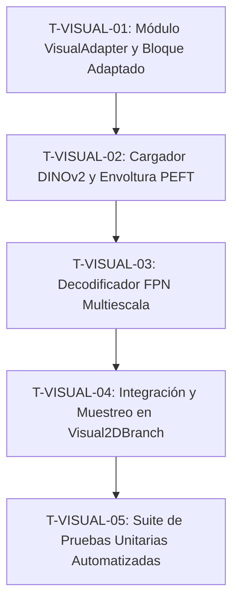

# Lista de Tareas Estructuradas: Rama Visual (2D) - DINOv2 con Visual Adapters y FPN

Este documento contiene el desglose de tareas atómicas y secuenciales para la implementación de la **Rama Visual (2D)** de la arquitectura **GSCA (Geo-Structural Cross-Attention)**, a partir del plan de implementación definido en [plan_rama_2d.md](file:///home/mrepetto/Documentos/GSCA/docs/rama-2D/plan_rama_2d.md).

---

## Tareas de Implementación y Pruebas

---

### T-VISUAL-01: Módulo de Adaptación Visual (VisualAdapter) y Bloque de Transformer Adaptado (AdaptedTransformerBlock)

- **ID**: `T-VISUAL-01`
- **Título**: Implementación del Módulo de Adaptación Visual (PEFT)
- **Descripción**: 
  Diseñar e implementar el adaptador de cuello de botella en paralelo y la estructura que envuelve un bloque Transformer nativo del backbone DINOv2. El objetivo es inyectar parámetros entrenables que capturen las altas frecuencias espaciales del afloramiento geológico sin degradar la inicialización y el conocimiento previo del modelo DINOv2.

- **Requisitos Técnicos Duros**:
  - **Clase `VisualAdapter(nn.Module)`**:
    - **Constructor**: `__init__(self, embed_dim: int, bottleneck_dim: int)`
      - `embed_dim` (entero): Dimensión de entrada y salida del embedding del Transformer (ej. 768 para ViT-Base).
      - `bottleneck_dim` (entero): Dimensión reducida interna para el cuello de botella (ej. 64 o 128).
    - **Submódulos**:
      - `down_proj`: `nn.Linear(embed_dim, bottleneck_dim)`
      - `act_fn`: `nn.GELU()` u otra función de activación no lineal equivalente.
      - `up_proj`: `nn.Linear(bottleneck_dim, embed_dim)`
    - **Inicialización de Pesos**:
      - `down_proj`: Inicializado con el método Kaiming Uniforme.
      - `up_proj.weight`: Inicializado exactamente a cero (`nn.init.zeros_`).
      - `up_proj.bias`: Inicializado exactamente a cero (`nn.init.zeros_`).
    - **Firma `forward`**: `forward(self, x: torch.Tensor) -> torch.Tensor`
      - Entrada: `x` de forma `[B, L, embed_dim]` (tipo `torch.float32`).
      - Retorno: Tensor de forma `[B, L, embed_dim]`.
  - **Clase `AdaptedTransformerBlock(nn.Module)`**:
    - **Constructor**: `__init__(self, original_block: nn.Module, adapter: VisualAdapter)`
      - `original_block` (nn.Module): Bloque original del Transformer ViT (de `facebookresearch/dinov2` o `timm`).
      - `adapter` (VisualAdapter): Módulo adaptador correspondiente.
    - **Firma `forward`**: `forward(self, x: torch.Tensor) -> torch.Tensor`
      - Entrada: `x` de forma `[B, L, embed_dim]`.
      - Lógica de ejecución:
        1. Utilizar los bloques de atención y normalizaciones nativos del `original_block`. El flujo del Transformer debe ser modificado de modo que, si el original calcula la suma residual del MLP como `x = x + original_block.mlp(original_block.norm2(x))`, el bloque adaptado calcule:
           $$x_{norm} = \text{original\_block.norm2}(x)$$
           $$y = \text{original\_block.mlp}(x_{norm}) + \text{adapter}(x_{norm})$$
           $$x = x + y$$
      - Retorno: Tensor de forma `[B, L, embed_dim]`.

- **Criterios de Aceptación**:
  - Al procesar un tensor dummy `x` de forma `[2, 257, 768]` con un bloque original y su versión adaptada (teniendo el adaptador recién inicializado), la salida debe cumplir `torch.allclose(output_original, output_adaptado, atol=1e-7)`.
  - La clase `AdaptedTransformerBlock` debe exponer todos los métodos y atributos del `original_block` necesarios para no alterar las llamadas de extracción del backbone.

---

### T-VISUAL-02: Cargador del Backbone y Mecanismo de Congelamiento / Envoltura

- **ID**: `T-VISUAL-02`
- **Título**: Cargador y Envolvedor del Backbone DINOv2 con Adaptadores PEFT
- **Descripción**:
  Implementar la lógica para cargar el backbone preentrenado DINOv2, congelar sus parámetros por defecto y reemplazar selectivamente los bloques Transformer especificados por la versión adaptada (`AdaptedTransformerBlock`).

- **Requisitos Técnicos Duros**:
  - **Función**: `load_and_adapt_dinov2(backbone_name: str, bottleneck_dim: int, intermediate_layers: List[int], pretrained: bool = True) -> nn.Module`
    - Carga del modelo base usando `torch.hub` (ej. `torch.hub.load('facebookresearch/dinov2', backbone_name, pretrained=pretrained)`).
    - Deshabilitación de gradientes global: Configurar `.requires_grad = False` para todos los parámetros iniciales del backbone.
    - Reemplazo y envoltura de bloques:
      - Iterar sobre la lista `intermediate_layers` (ej. `[3, 6, 9, 12]` para ViT-Base).
      - Para cada índice `idx`, extraer el bloque original en `backbone.blocks[idx]`.
      - Instanciar `VisualAdapter` con la dimensión de embedding del bloque y el `bottleneck_dim` indicado.
      - Instanciar `AdaptedTransformerBlock` envolviendo el bloque original y el adaptador.
      - Reemplazar `backbone.blocks[idx]` por la nueva instancia adaptada.
      - Asegurar que `.requires_grad = True` únicamente para los parámetros pertenecientes a los módulos de adaptación inyectados (`adapter`).
    - Retorno: Instancia modificada de `nn.Module` (el backbone DINOv2 adaptado).

- **Criterios de Aceptación**:
  - Al inspeccionar recursivamente todos los parámetros del modelo retornado, solo los parámetros de `VisualAdapter` deben tener `requires_grad == True`. El resto de los parámetros de DINOv2 deben ser no entrenables.
  - El modelo modificado debe poder ejecutar un paso forward con un tensor dummy de entrada `[B, 3, H, W]` y producir representaciones intermedias sin lanzar excepciones de forma o tipo de datos.

---

### T-VISUAL-03: Decodificador FPN Multiescala (VisualFPN)

- **ID**: `T-VISUAL-03`
- **Título**: Implementación del Decodificador FPN Multiescala
- **Descripción**:
  Implementar una Feature Pyramid Network (FPN) ligera que tome características multiescala extraídas de los bloques adaptados del Transformer y las proyecte y combine a diferentes escalas espaciales para recuperar descriptores densos en la resolución original de la imagen.

- **Requisitos Técnicos Duros**:
  - **Clase `VisualFPN(nn.Module)`**:
    - **Constructor**: `__init__(self, embed_dim: int, fpn_dim: int, out_dim: int)`
      - `embed_dim` (entero): Dimensión de las capas del backbone ViT (ej. 768).
      - `fpn_dim` (entero): Dimensión interna uniforme de canales de la pirámide (ej. 256).
      - `out_dim` (entero): Dimensión final del descriptor denso a nivel de píxel (ej. 256).
    - **Capas Requeridas**:
      - Convoluciones $1\times1$ de proyección: 4 capas `nn.Conv2d(embed_dim, fpn_dim, kernel_size=1)` para unificar las dimensiones de canales de las características intermedias $F_0, F_1, F_2, F_3$.
      - Operadores de escala para la Pirámide Artificial:
        - Nivel 0 ($F_0$): Proyectado de parche a $1/4$ resolución original mediante `nn.ConvTranspose2d(fpn_dim, fpn_dim, kernel_size=4, stride=4)`.
        - Nivel 1 ($F_1$): Proyectado de parche a $1/8$ resolución original mediante `nn.ConvTranspose2d(fpn_dim, fpn_dim, kernel_size=2, stride=2)`.
        - Nivel 2 ($F_2$): Identidad (mantiene resolución nativa de parches, $1/14$ de la resolución original).
        - Nivel 3 ($F_3$): Proyectado de parche a $1/28$ resolución original mediante `nn.Conv2d(fpn_dim, fpn_dim, kernel_size=3, stride=2, padding=1)`.
      - Fusión top-down:
        - Utilizar interpolación bilineal para alinear las formas espaciales de los niveles adyacentes:
          - De $P_4$ ($1/28$) a $P_3$ ($1/14$): Upsampling factor espacial de 2x.
          - De $P_{3\_out}$ ($1/14$) a $P_2$ ($1/8$): Upsampling bilineal exacto al tamaño de $P_2$.
          - De $P_{2\_out}$ ($1/8$) a $P_1$ ($1/4$): Upsampling factor espacial de 2x.
        - Suma elemental de características fusionadas:
          - $P_{3\_out} = P_3 + \text{Upsample}(P_4)$
          - $P_{2\_out} = P_2 + \text{Upsample}(P_{3\_out})$
          - $P_{1\_out} = P_1 + \text{Upsample}(P_{2\_out})$
      - Proyección y salida:
        - Convolución final de $3\times3$ con padding 1: `nn.Conv2d(fpn_dim, out_dim, kernel_size=3, padding=1)`.
        - Interpolación bilineal final para llevar la salida de resolución $1/4$ al tamaño original `target_shape = [H, W]`.
    - **Firma `forward`**: `forward(self, features_list: List[torch.Tensor], target_shape: Tuple[int, int]) -> torch.Tensor`
      - Entrada: `features_list` con 4 tensores espaciales reformateados a forma `[B, embed_dim, H_p, W_p]` con `H_p = H / 14` y `W_p = W / 14`.
      - Entrada: `target_shape` es una tupla `(H, W)`.
      - Retorno: Tensor `dense_descriptors` de forma `[B, out_dim, H, W]`.

- **Criterios de Aceptación**:
  - Al ingresar una lista de 4 tensores de dimensiones `[B, 768, 16, 16]` y un `target_shape = (224, 224)`, la FPN debe retornar un tensor de forma `[B, out_dim, 224, 224]`.
  - La red no debe generar valores indeterminados o NaN durante el cálculo en ninguno de sus bloques.
  - Todos los parámetros de `VisualFPN` deben tener `requires_grad = True` para permitir su entrenamiento completo.

---

### T-VISUAL-04: Integración del Módulo Visual Branch y Muestreo Bilineal

- **ID**: `T-VISUAL-04`
- **Título**: Integración de la Rama Visual 2D y Muestreo de Descriptores
- **Descripción**:
  Implementar la clase principal `Visual2DBranch` que actúa como interfaz del módulo visual 2D. Se encarga de preprocesar las imágenes, invocar al backbone adaptado, capturar las activaciones multiescala, pasarlas por el decodificador `VisualFPN` y realizar un muestreo de precisión subpíxel mediante interpolación bilineal en coordenadas normalizadas.

- **Requisitos Técnicos Duros**:
  - **Clase `Visual2DBranch(nn.Module)`**:
    - **Constructor**: `__init__(self, backbone_name: str, bottleneck_dim: int, intermediate_layers: List[int], out_dim: int, pretrained: bool = True)`
      - Inicializar el backbone adaptado usando la función `load_and_adapt_dinov2`.
      - Inicializar el decodificador `VisualFPN` utilizando el `embed_dim` adecuado y la dimensión de salida `out_dim`.
    - **Lógica de Extracción de Parches**:
      - El paso forward de DINOv2 retorna secuencias de tokens de forma `[B, L, embed_dim]`. El código de extracción debe separar el token de clase `cls_token` (índice 0) y los tokens de registro si existen, reordenando los tokens espaciales restantes a forma bidimensional `[B, embed_dim, H_p, W_p]` con `H_p = H/14` y `W_p = W/14`.
    - **Lógica de Muestreo**:
      - Si se provee `coords_2d` de forma `[B, N, 2]`, normalizar las coordenadas a escala `[-1.0, 1.0]` según sea necesario.
      - Ejecutar el muestreo usando `torch.nn.functional.grid_sample(dense_descriptors, coords_2d.unsqueeze(2), mode='bilinear', padding_mode='zeros', align_corners=False)`.
      - Rearreglar la salida a forma `[B, N, out_dim]` y aplicar normalización L2 a nivel de vector descriptor en la última dimensión (`dim=-1`).
    - **Firma `forward`**: `forward(self, images: torch.Tensor, coords_2d: Optional[torch.Tensor] = None) -> Tuple[torch.Tensor, Optional[torch.Tensor]]`
      - Entrada: `images` de forma `[B, 3, H, W]` con valores normalizados con la media $\mu = [0.485, 0.456, 0.406]$ y desviación estándar $\sigma = [0.229, 0.224, 0.225]$.
      - Entrada: `coords_2d` (opcional): tensor de forma `[B, N, 2]`.
      - Retorno: Tupla `(dense_descriptors, sampled_descriptors)`.
        - `dense_descriptors`: Tensor de forma `[B, out_dim, H, W]`.
        - `sampled_descriptors`: Tensor de forma `[B, N, out_dim]` (o `None` si no se provee `coords_2d`).

- **Criterios de Aceptación**:
  - Para `images` con forma `[2, 3, 224, 224]` y `coords_2d` de forma `[2, 120, 2]`, debe retornar un tensor densificado de forma `[2, out_dim, 224, 224]` y descriptores muestreados de forma `[2, 120, out_dim]`.
  - La norma de cada vector descriptor individual de `sampled_descriptors` a lo largo de la dimensión del canal debe ser exactamente 1.0 (dentro de los límites de precisión numérica, tolerancia de $10^{-6}$).

---

### T-VISUAL-05: Suite de Pruebas Unitarias Automatizadas

- **ID**: `T-VISUAL-05`
- **Título**: Suite de Pruebas Unitarias para la Rama Visual 2D
- **Descripción**:
  Implementar la suite de pruebas unitarias automatizadas utilizando el framework `pytest` para garantizar el correcto flujo de gradientes, la consistencia dimensional, la invarianza del batching, y la robustez del muestreo ante coordenadas límite.

- **Requisitos Técnicos Duros**:
  - **Ubicación del Archivo**: `/home/mrepetto/Documentos/GSCA/tests/test_visual_branch.py`
  - **Casos de Prueba Requeridos**:
    1. **`test_output_dimensions`**:
       - Probar con combinaciones: lote $B \in \{1, 4\}$, resoluciones de imagen $H, W \in \{(224, 224), (518, 518)\}$, y número de puntos $N \in \{50, 150\}$.
       - Aserciones: Comprobar las formas resultantes de `dense_descriptors` (`[B, out_dim, H, W]`) y `sampled_descriptors` (`[B, N, out_dim]`).
    2. **`test_gradient_flow_and_frozen_weights`**:
       - Inicializar el modelo `Visual2DBranch` y realizar un paso forward y backward usando una pérdida de suma simple sobre `sampled_descriptors`.
       - Aserciones:
         - Todos los parámetros pertenecientes al backbone base de DINOv2 (que no sean adaptadores) deben tener `.grad` como `None`.
         - Todos los parámetros de `VisualAdapter` y `VisualFPN` deben tener `.grad` distinto de `None` y norma mayor a cero.
    3. **`test_adapter_identity_on_init`**:
       - Comparar la salida de un bloque Transformer original y su bloque adaptado correspondiente.
       - Aserciones:
         - La diferencia absoluta máxima entre ambos tensores de salida (`torch.max(torch.abs(out_orig - out_adapt))`) debe ser menor que $10^{-7}$.
    4. **`test_robust_sampling_coordinates`**:
       - Pasar un lote de coordenadas límite como `[-1.0, -1.0]`, `[1.0, 1.0]` y fuera de límites como `[-1.1, 1.2]` a `coords_2d`.
       - Aserciones:
         - Verificar que la salida no contenga valores `NaN` o `inf`.
         - Verificar que los descriptores resultantes de las coordenadas fuera del rango `[-1.0, 1.0]` sean cero (debido a `padding_mode='zeros'` de `grid_sample`).
    5. **`test_batching_invariance`**:
       - Comparar el descriptor en la posición $k$ del lote obtenido al procesar una imagen de forma aislada, versus el obtenido cuando es parte de un lote de tamaño $B > 1$.
       - Aserciones:
         - La diferencia absoluta máxima debe ser inferior a $10^{-6}$.

- **Criterios de Aceptación**:
  - Al ejecutar `pytest tests/test_visual_branch.py` desde la raíz del repositorio, se debe lograr una tasa de aprobación del 100% de los casos de prueba definidos.
  - La suite de pruebas debe ejecutarse en menos de 30 segundos (se recomienda usar un modelo base ligero como `dinov2_vits14` para propósitos de prueba en CPU).
