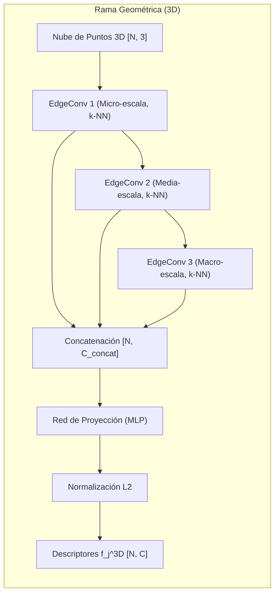

# Plan de Implementación: Rama Geométrica (3D)

Este documento detalla el plan de diseño y especificación técnica de la **Rama Geométrica (3D)** de la arquitectura **GSCA (Geo-Structural Cross-Attention)**. Este módulo procesa datos tridimensionales de afloramientos geológicos para generar descriptores densos en un espacio métrico compartido, facilitando el alineamiento preciso con el dominio visual de imágenes 2D.

---

## 1. Propósito y Contexto del Módulo

La **Rama Geométrica (3D)** de la arquitectura GSCA tiene como objetivo principal modelar y caracterizar la estructura tridimensional intrínseca del macizo rocoso a partir de nubes de puntos geológicas (típicamente capturadas mediante sensores activos como LiDAR terrestre o fotogrametría aérea).

### Desafío y Justificación del Diseño
En la fotogrametría y mapeo geológico tradicional, los métodos de correspondencia visual sufren un colapso de rendimiento debido al cambio de apariencia provocado por la iluminación solar cambiante (sombras móviles y reflectancia BRDF variable). La geometría estructural tridimensional (fracturas, fallas, contactos de estratos) se mantiene físicamente constante.

Para aprovechar esta invarianza geométrica:
* **Fallas en Baselines Tradicionales (PointNet)**: Las arquitecturas clásicas tratan los puntos como una bolsa desordenada y realizan un pooling global directo. Esto descarta el vecindario local, perdiendo la información de orientación espacial y discontinuidades (claves para identificar estructuras de falla o contactos estratigráficos).
* **Solución Propuesta (DGCNN + EdgeConv)**: Adoptamos una arquitectura basada en **Dynamic Graph CNN (DGCNN)**. Mediante el operador **EdgeConv**, se extrae información local que relaciona cada punto con sus vecinos más cercanos en el espacio de características latentes. Al recalcular el grafo local dinámicamente en cada capa profunda, la red captura **conectividad semántica** y transiciones topológicas complejas, agrupando puntos con orientaciones o rugosidades similares aunque se encuentren separados en el espacio físico euclidiano.
* **Naturaleza Fractal de la Roca (Multi-Escala)**: Las discontinuidades geológicas tienen una estructura fractal (patrones auto-similares a diferentes escalas). La rama 3D emplea bloques EdgeConv multiescala que se concatenan jerárquicamente para encapsular desde micro-rugosidades locales ($k$ vecindario pequeño) hasta megatendencias estratigráficas estructurales ($k$ vecindario grande).

### Ubicación en la Arquitectura General
El módulo geométrico recibe la nube de puntos y genera un descriptor denso $\mathbf{f}_j^{3D} \in \mathbb{R}^{C}$ para cada punto $p_j$. Este vector está normalizado en la esfera unitaria ($L_2$) y pertenece al mismo espacio latente que la salida de la **Rama Visual (2D)** ($\mathbf{f}_i^{2D}$), lo que permite que el **Módulo de Atención Cruzada (GSCA)** y la posterior estimación de la pose 6-DoF mediante RANSAC + PnP operen de forma congruente.



---

## 2. Especificación Estricta de Interfaces

Para garantizar la compatibilidad del extractor de características geométricas con los módulos de entrenamiento (Circle Loss) y de correspondencia (Cross-Attention en GSCA), se definen las siguientes interfaces de tensores:

### A. Tensores de Entrada

1. **`pos`** (Coordenadas Espaciales 3D):
   * **Representación**: Posición física del conjunto de puntos.
   * **Forma (Shape)**: `[N, 3]` donde $N$ es el número total de puntos acumulados en el batch.
   * **Tipo de Datos (Dtype)**: `torch.float32`.
   * **Rango de Valores**: Coordenadas reales continuas $(-\infty, \infty)$. Típicamente centradas en la media espacial del afloramiento o en el origen de coordenadas locales para mantener estabilidad numérica.
   * **Estructura Interna**: `[x_i, y_i, z_i]` para cada punto $i \in \{1, \dots, N\}$.

2. **`batch`** (Indicador de Pertenencia al Batch):
   * **Representación**: Vector de mapeo que asocia cada punto de la lista a su correspondiente ejemplo dentro del minilote procesado de forma paralela.
   * **Forma (Shape)**: `[N]` (el mismo tamaño del primer eje de `pos`).
   * **Tipo de Datos (Dtype)**: `torch.int64`.
   * **Rango de Valores**: $[0, B-1]$ donde $B$ es el tamaño del batch.
   * **Comportamiento**: Un vector de la forma `[0, 0, ..., 1, 1, ..., B-1, B-1]` que le indica a la biblioteca PyTorch Geometric qué subconjunto de puntos pertenece a qué nube individual para evitar conexiones de aristas incorrectas entre diferentes afloramientos durante la computación de los grafos dinámicos.

### B. Tensores de Salida

1. **`feat_3d`** (Descriptores Geométricos Densos):
   * **Representación**: Vectores de características latentes proyectados al espacio métrico común $\mathcal{Z}$.
   * **Forma (Shape)**: `[N, C]` donde $C$ es la dimensión del espacio latente común de descriptores (ajustado por defecto a `out_channels = 256` para ser equivalente con la rama visual FPN 2D).
   * **Tipo de Datos (Dtype)**: `torch.float32`.
   * **Rango de Valores**: $[-1.0, 1.0]$. Esto es un requerimiento estricto debido a que se aplica una normalización $L_2$ por fila al final del módulo, garantizando que para cualquier punto $j$, $\|\mathbf{f}_j^{3D}\|_2 = 1.0$.

### C. Dimensiones y Configuración de Batch Size
* **Batch Size ($B$)**: Recomendado entre $2$ y $16$ ejemplos por iteración. Debido a que se construyen grafos $k$-NN en el espacio latente y las GPU almacenan matrices de distancia por pares locales, tamaños de lote grandes ($B > 16$) en nubes densas de puntos ($N_{individual} \ge 20,000$) pueden exceder los límites de memoria de video (VRAM).
* **Parámetro $k$ (Vecinos más cercanos)**: Configurado por defecto a $k = 20$. Regula el tamaño local de la vecindad de cálculo en los bloques EdgeConv dinámicos.

---

## 3. Flujo Lógico Interno y Algoritmos

El procesamiento interno de la rama 3D se basa en la construcción dinámica del grafo y la posterior agregación de las aristas a múltiples escalas.

### Algoritmo Conceptual del Operador EdgeConv Dinámico

El operador EdgeConv dinámico procesa una matriz de características de nodos $X^{(l)} \in \mathbb{R}^{N \times d_{in}}$ en la capa $l$:

1. **Búsqueda de Vecinos ($k$-NN)**: Se calcula la distancia euclidiana por pares en el espacio latente $X^{(l)}$ únicamente para los puntos del mismo lote (restringido por el vector `batch`). Para cada punto $i$, se genera una lista de índices de sus $k$ vecinos más cercanos:
   $$\mathcal{N}(i) = \{j_1, j_2, \dots, j_k\}$$
2. **Generación de Características de Arista**: Para cada par ordenado $(i, j)$ donde $j \in \mathcal{N}(i)$, se concatena la característica absoluta del nodo con la diferencia relativa del vector:
   $$\mathbf{x}_{edge}^{(i, j)} = \left[ X^{(l)}_i, X^{(l)}_j - X^{(l)}_i \right] \in \mathbb{R}^{2 \cdot d_{in}}$$
3. **Mapeo No Lineal local (MLP)**: Las características de arista se alimentan a un perceptrón multicapa compartido $h_{\Theta}$:
   $$\mathbf{e}_{i,j} = h_{\Theta}\left(\mathbf{x}_{edge}^{(i, j)}\right) = \text{ReLU}\Big(\text{BatchNorm1d}\big(\mathbf{W} \cdot \mathbf{x}_{edge}^{(i, j)} + \mathbf{b}\big)\Big) \in \mathbb{R}^{d_{out}}$$
4. **Agregación Simétrica (Max-Pooling)**: Las características procesadas de las aristas incidentes de cada nodo se combinan usando el operador máximo, logrando inmunidad al orden de los nodos en el grafo:
   $$X^{(l+1)}_i = \max_{j \in \mathcal{N}(i)} \mathbf{e}_{i,j} \in \mathbb{R}^{d_{out}}$$

---

### Pseudocódigo de la Arquitectura de la Rama Geométrica (3D)

El siguiente algoritmo de flujo describe la secuencia lógica de extracción y consolidación de características a través de las capas internas:

```
ALGORITMO GeometricFeatureExtractor
    ENTRADAS:
        pos: Tensor de forma [N, 3] (coordenadas de puntos 3D)
        batch: Tensor de forma [N] (id de batch por punto en PyG)
        k: Entero (número de vecinos en KNN)
        out_channels: Entero (dimensión del espacio latente común)
    
    SALIDA:
        feat_3d: Tensor de forma [N, out_channels] (descriptores normalizados)

    PASO 1: Bloque de Convolución en Grafo - Nivel 1 (Micro-escala)
        // La entrada posee dimensión d_in = 3 (coordenadas x,y,z).
        // Se define un MLP interno_1 que mapea de 3 * 2 (6 dimensiones) a 64 dimensiones.
        // Se calcula el k-NN de "pos" en el espacio de coordenadas físicas 3D (para la primera capa).
        x1 <- DynamicEdgeConv(nn=MLP_1(6 -> 64), k=k, aggr='max')(pos, batch) // [N, 64]
        
    PASO 2: Bloque de Convolución en Grafo - Nivel 2 (Media-escala)
        // La entrada es x1 de dimensión 64. 
        // Se define un MLP interno_2 que mapea de 64 * 2 (128 dimensiones) a 128 dimensiones.
        // Se calcula el k-NN dinámico basado en las distancias en el espacio latente x1.
        x2 <- DynamicEdgeConv(nn=MLP_2(128 -> 128), k=k, aggr='max')(x1, batch) // [N, 128]
        
    PASO 3: Bloque de Convolución en Grafo - Nivel 3 (Macro-escala)
        // La entrada es x2 de dimensión 128. 
        // Se define un MLP interno_3 que mapea de 128 * 2 (256 dimensiones) a 256 dimensiones.
        // Se calcula el k-NN dinámico basado en las distancias en el espacio latente x2.
        x3 <- DynamicEdgeConv(nn=MLP_3(256 -> 256), k=k, aggr='max')(x2, batch) // [N, 256]

    PASO 4: Fusión Multi-Escala (Skip Connections para Captura Fractal)
        // Se concatenan las características de diferentes niveles de abstracción
        // para retener tanto detalles geométricos finos como contextos macro.
        x_concat <- Concatenar(x1, x2, x3) a lo largo del último eje (dimensión -1) // [N, 64 + 128 + 256] = [N, 448]

    PASO 5: Proyección Lineal Global
        // Se pasa la representación fusionada por una red de proyección de dos capas lineales:
        // Capa_Proj_1: Lineal(448 -> 512) -> BatchNorm1d(512) -> ReLU()
        // Capa_Proj_2: Lineal(512 -> out_channels)
        x_proj <- RedDeProyección(x_concat) // [N, out_channels]

    PASO 6: Normalización de Espacio Métrico
        // Se proyectan los descriptores a la superficie de la hiperesfera L2 de radio 1.
        // Esto permite comparar directamente los descriptores 3D con los 2D mediante producto punto.
        feat_3d <- NormalizarL2(x_proj, dim=-1) // [N, out_channels]

    RETORNAR feat_3d
FIN ALGORITMO
```

---

## 4. Dependencias del Módulo

La implementación de este módulo requiere librerías especializadas en Deep Learning geométrico para evitar la implementación manual e ineficiente de operaciones de grafos en CPU/GPU.

1. **PyTorch (versión >= 2.0.0)**:
   * Requerido para la computación de autogradientes, instanciación de tensores, capas de procesamiento lineal (`nn.Linear`), normalización por lote (`nn.BatchNorm1d`) y normalización matemática de tensores.

2. **PyTorch Geometric (PyG) (versión >= 2.3.0)**:
   * **`torch_geometric.nn.conv.DynamicEdgeConv`**: Implementación CUDA altamente optimizada del bloque EdgeConv que actualiza y calcula dinámicamente los vecinos en GPU en milisegundos.
   * **`torch_geometric.nn.pool.knn`**: Para las operaciones internas de cálculo de vecinos más cercanos sobre conjuntos de puntos no estructurados.
   * Utiliza la clase de lote disperso `Batch` de PyG para empaquetar nubes de puntos de tamaños variables de manera compacta sin necesidad de rellenar con ceros (padding).

3. **CUDA Toolkit (versión compatible con PyTorch)**:
   * Esencial debido a la complejidad temporal $\mathcal{O}(N^2)$ implícita en el cálculo de las distancias por pares para la vecindad $k$-NN. Los kernels optimizados de PyG requieren compilación sobre CUDA para garantizar rendimiento en tiempo real en tareas de matching.

---

## 5. Estrategia y Diseño de Pruebas Unitarias

Para verificar de forma aislada que el extractor de características geométricas 3D funcione correctamente antes de integrarlo al módulo GSCA y a la pérdida métrica Circle Loss, se implementará un conjunto de pruebas unitarias basadas en las siguientes propiedades matemáticas del extractor:

### A. Prueba de Invariancia a la Permutación
* **Objetivo**: Garantizar que el orden de las filas en la nube de puntos no altere la representación semántica latente del descriptor del punto correspondiente. Las nubes de puntos no tienen un orden natural y el modelo debe ser equivariante frente a permutaciones.
* **Método de Prueba**:
  1. Generar una nube de puntos sintética aleatoria `pos_A` de tamaño `[N, 3]`.
  2. Crear una permutación aleatoria de índices $P$.
  3. Aplicar la permutación para obtener la nube de puntos desordenada `pos_B = pos_A[P]`.
  4. Pasar ambas nubes por el módulo para obtener `feat_A` y `feat_B`.
  5. Validar que la permutación aplicada a la salida de `feat_A` sea equivalente a `feat_B`:
     $$\text{feat\_A}[P] \approx \text{feat\_B}$$
     Con una tolerancia de precisión simple de $10^{-6}$.

### B. Prueba de Invariancia a la Traslación Global
* **Objetivo**: Dado que las características de arista del operador EdgeConv se definen sobre diferencias vectoriales locales ($p_j - p_i$), el descriptor extraído de un afloramiento debe ser independiente de su ubicación global en el sistema de coordenadas.
* **Método de Prueba**:
  1. Generar una nube de puntos aleatoria `pos`.
  2. Definir un vector de traslación aleatorio $\mathbf{t} = [t_x, t_y, t_z]$ en $\mathbb{R}^3$.
  3. Crear una nueva nube trasladada: `pos_trans = pos + t`.
  4. Procesar ambas nubes de forma independiente mediante la red de características geométricas.
  5. Confirmar que los descriptores resultantes `feat_original` y `feat_trans` sean exactamente idénticos (tolerancia de precisión simple de $10^{-5}$):
     $$\|\text{feat\_original} - \text{feat\_trans}\|_\infty < 10^{-5}$$

### C. Prueba de Formato de Salida y Normalización L2
* **Objetivo**: Asegurar que las dimensiones de salida coincidan exactamente con la dimensión latente común $C$ y que todos los vectores estén normalizados correctamente para evitar explosión de gradientes en Circle Loss.
* **Método de Prueba**:
  1. Instanciar el módulo con un valor arbitrario de `out_channels = 256`.
  2. Alimentar una nube de puntos sintética con $N = 1000$ puntos.
  3. Verificar que la forma del tensor resultante sea exactamente `(1000, 256)`.
  4. Calcular la norma euclidiana por filas de la salida:
     $$\mathbf{n}_j = \|\mathbf{f}_j^{3D}\|_2$$
  5. Asegurar que cada uno de los 1000 elementos de la norma tenga un valor de $1.0$ con un margen de error menor a $10^{-6}$.

### D. Prueba de Aislamiento del Batch (No Filtración)
* **Objetivo**: Asegurar que cuando se procesan múltiples afloramientos en paralelo en un minilote usando la estructura de datos dispersa de PyG, las características extraídas para los puntos de la nube 1 sean idénticas a las obtenidas si la nube 1 se procesara sola. La vecindad de grafos dinámicos no debe cruzar fronteras de batch.
* **Método de Prueba**:
  1. Crear dos nubes de puntos distintas: `pos_1` de tamaño $N_1$ y `pos_2` de tamaño $N_2$.
  2. Procesar `pos_1` sola y almacenar sus descriptores: `feat_solo_1`.
  3. Empaquetar ambas nubes en un único lote combinando `pos_all = concat(pos_1, pos_2)` y definiendo el vector `batch` que contiene $0$ para los primeros $N_1$ elementos e $1$ para los siguientes $N_2$ elementos.
  4. Procesar el lote unificado y extraer los primeros $N_1$ descriptores de la salida conjunta: `feat_batch_1`.
  5. Comprobar que `feat_solo_1` y `feat_batch_1` sean numéricamente idénticos (tolerancia de $10^{-6}$).

### E. Prueba de Flujo de Gradiente (Backward Pass)
* **Objetivo**: Validar que el grafo computacional de PyTorch no se corte debido a operaciones incorrectas (como clonación de tensores sin registro de gradiente o uso inapropiado de variables fuera del grafo de autograd) y que todos los pesos entrenables reciban gradientes.
* **Método de Prueba**:
  1. Activar el cálculo de gradientes en el modelo.
  2. Generar entradas aleatorias ficticias y realizar un paso forward.
  3. Definir una pérdida artificial a partir de la salida (por ejemplo, la suma de los descriptores).
  4. Ejecutar el paso backward (`loss.backward()`).
  5. Recorrer los parámetros del modelo y verificar que:
     * El gradiente (`param.grad`) de todas las capas lineales (`nn.Linear`) no sea nulo (`None`).
     * No haya valores indeterminados (`NaN`) ni infinitos (`Inf`) en los tensores de gradiente acumulados.
