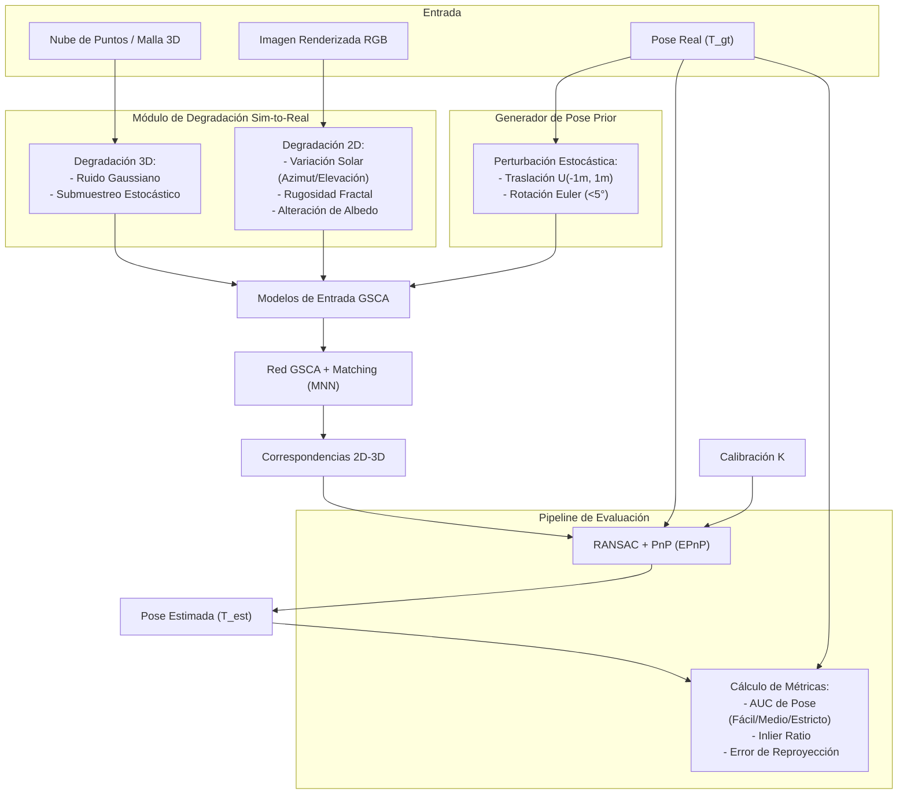

# Plan de Implementación: Validación y Estrategia Sim-to-Real (GSCA)

Este documento detalla el plan de implementación técnica para el módulo **Validación y Estrategia Sim-to-Real** dentro del proyecto GSCA (Geo-Structural Cross-Attention). Este módulo se encarga de mitigar la brecha geométrica y visual entre datos sintéticos y reales, de sintetizar perturbaciones realistas para simular condiciones de campo, y de evaluar el rendimiento del alineamiento 2D-3D mediante métricas y baselines robustos.

---

## 1. Propósito y Contexto del Módulo

El objetivo de este módulo es proporcionar una infraestructura rigurosa de prueba y validación para el algoritmo de emparejamiento 2D-3D. En el campo de la geología digital, obtener un etiquetado preciso del "Ground Truth" (pose 6-DoF real de la cámara en relación con el afloramiento) es sumamente difícil debido a la imprecisión del GPS/IMU y a la variabilidad de las condiciones lumínicas en entornos exteriores.

El módulo administra estas dificultades mediante:
1. **Entorno de Simulación Virtual**: Orquestación de datos sintéticos (mallas 3D y renders 2D) generados en Unity/OpenGL con conocimiento absoluto de la pose.
2. **Pipeline de Degradación Estocástica (Sim-to-Real)**: Inyección de ruido sintético y variaciones de iluminación a los datos de entrenamiento para prevenir el sobreajuste a la perfección sintética, permitiendo una transferencia directa y generalizada (*Zero-Shot*) a conjuntos de datos del mundo real (como Svalbox, eRock y OpenTopography).
3. **Generador del Prior de Pose ($T_{prior}$)**: Perturbación estocástica controlada de la pose real para simular la incertidumbre inicial de los sensores portátiles en campo.
4. **Módulo de Evaluación de Pose y Correspondencias**: Pipeline de estimación de pose mediante RANSAC + PnP y cuantificación mediante métricas estandarizadas (AUC del error de pose, Inlier Ratio, y Error de Reproyección).



---

## 2. Especificación Estricta de Interfaces

El módulo se implementará en Python con soporte nativo para PyTorch. Las interfaces se especifican de manera precisa a continuación:

### A. Componente de Degradación Geométrica 3D

* **Función**: `degrade_point_cloud(point_cloud, noise_std, downsample_ratio)`
  * **Entradas**:
    * `point_cloud`: `torch.Tensor` de dimensión `[B, N, 3]`, tipo `torch.float32`. Representa las coordenadas espaciales $(x, y, z)$ en metros.
    * `noise_std`: `float`. Desviación estándar del ruido Gaussiano a inyectar (rango recomendado: `0.01` a `0.05` metros).
    * `downsample_ratio`: `float`. Proporción de puntos a conservar de la nube original (rango: `(0.0, 1.0]`).
  * **Salidas**:
    * `point_cloud_degraded`: `torch.Tensor` de dimensión `[B, N_degraded, 3]`, tipo `torch.float32`, donde $N_{degraded} = \text{int}(N \times \text{downsample\_ratio})$.

### B. Componente de Degradación Visual 2D

* **Función**: `apply_visual_degradations(image, normal_map, albedo_map, sun_azimuth, sun_elevation, roughness_factor)`
  * **Entradas**:
    * `image`: `torch.Tensor` de dimensión `[B, 3, H, W]`, tipo `torch.float32`. Imagen RGB sintética original en rango `[0.0, 1.0]`.
    * `normal_map`: `torch.Tensor` de dimensión `[B, 3, H, W]`, tipo `torch.float32`. Mapa de normales de superficie en espacio de cámara (normalizado en `[-1.0, 1.0]`).
    * `albedo_map`: `torch.Tensor` de dimensión `[B, 3, H, W]`, tipo `torch.float32`. Textura difusa sin iluminación en rango `[0.0, 1.0]`.
    * `sun_azimuth`: `torch.Tensor` de dimensión `[B]`, tipo `torch.float32`. Ángulo acimut del sol en grados (rango `[0.0, 360.0]`).
    * `sun_elevation`: `torch.Tensor` de dimensión `[B]`, tipo `torch.float32`. Ángulo de elevación del sol en grados (rango `[-90.0, 90.0]`).
    * `roughness_factor`: `float`. Factor de perturbación de micro-rugosidad mediante ruido fractal.
  * **Salidas**:
    * `image_degraded`: `torch.Tensor` de dimensión `[B, 3, H, W]`, tipo `torch.float32`. Imagen perturbada que emula las variaciones de iluminación física, meteorización química (alteración de albedo) y micro-fracturas (normales perturbadas).

### C. Generador del Prior de Pose

* **Función**: `synthesize_pose_prior(pose_gt, max_trans=1.0, max_rot_deg=5.0)`
  * **Entradas**:
    * `pose_gt`: `torch.Tensor` de dimensión `[B, 4, 4]`, tipo `torch.float32`. Representa la matriz de transformación homogénea real $[\mathbf{R}_{gt} \mid \mathbf{t}_{gt}]$ de la cámara al mundo.
    * `max_trans`: `float`. Rango del desplazamiento uniforme en metros para cada eje (default: `1.0` m).
    * `max_rot_deg`: `float`. Magnitud máxima en grados de la perturbación angular de Euler (default: `5.0` grados).
  * **Salidas**:
    * `pose_prior`: `torch.Tensor` de dimensión `[B, 4, 4]`, tipo `torch.float32`. Representa la pose inicial perturbada $\mathbf{T}_{prior}$.

### D. Componente de Evaluación de Pose y Correspondencias

* **Función**: `evaluate_alignment(pose_est, pose_gt, correspondences, intrinsics_K)`
  * **Entradas**:
    * `pose_est`: `torch.Tensor` de dimensión `[B, 4, 4]`, tipo `torch.float32`. Poses estimadas por el solucionador RANSAC+PnP.
    * `pose_gt`: `torch.Tensor` de dimensión `[B, 4, 4]`, tipo `torch.float32`. Poses reales de referencia.
    * `correspondences`: `Dict` que contiene:
      * `pts_2d`: `torch.Tensor` de dimensión `[B, M, 2]`, tipo `torch.float32`. Puntos clave en coordenadas de imagen de las correspondencias obtenidas por el algoritmo MNN.
      * `pts_3d`: `torch.Tensor` de dimensión `[B, M, 3]`, tipo `torch.float32`. Coordenadas 3D correspondientes a los puntos clave 2D.
      * `inlier_mask`: `torch.Tensor` de dimensión `[B, M]`, tipo `torch.bool`. Máscara booleana obtenida tras RANSAC que indica si la correspondencia es geométricamente consistente.
    * `intrinsics_K`: `torch.Tensor` de dimensión `[B, 3, 3]`, tipo `torch.float32`. Matrices intrínsecas de la cámara.
  * **Salidas**:
    * `metrics`: `Dict` que contiene:
      * `translation_error`: `torch.Tensor` de dimensión `[B]`, en metros.
      * `rotation_error`: `torch.Tensor` de dimensión `[B]`, en grados.
      * `auc_pose`: `Dict[str, float]`. AUC calculado para los tres umbrales de tolerancia:
        * `"easy"`: $(20\text{ cm}, 10^\circ)$
        * `"medium"`: $(10\text{ cm}, 5^\circ)$
        * `"strict"`: $(5\text{ cm}, 1^\circ)$
      * `inlier_ratio`: `torch.Tensor` de dimensión `[B]`, tipo `torch.float32` (proporción de correspondencias válidas pre-RANSAC contra inliers post-RANSAC).
      * `reprojection_error`: `torch.Tensor` de dimensión `[B]`, tipo `torch.float32` (promedio de error de reproyección en píxeles para los inliers).

---

## 3. Flujo Lógico Interno y Algoritmos Conceptuales

El flujo lógico del módulo se describe mediante algoritmos conceptuales para cada subcomponente principal.

### Algoritmo 1: Pipeline de Degradación Estocástica 3D
```
Entrada: point_cloud (Tensor [B, N, 3]), noise_std (float), downsample_ratio (float)
1. Para cada elemento b en el lote (batch size B):
    a. Extraer pc_b de tamaño [N, 3].
    b. Calcular número de puntos a conservar: N_target = int(N * downsample_ratio).
    c. Generar una permutación aleatoria de índices: indices = random_permutation(N).
    d. Seleccionar subconjunto de puntos: pc_sub = pc_b[indices[:N_target]].
    e. Generar ruido gaussiano: ruido = normal_distribution(mean=0, std=noise_std, size=[N_target, 3]).
    f. Inyectar ruido: pc_degraded = pc_sub + ruido.
    g. Almacenar pc_degraded en el lote de salida.
Retornar point_cloud_degraded (Tensor [B, N_target, 3])
```

### Algoritmo 2: Perturbación Estocástica de Pose ($T_{prior}$)
```
Entrada: pose_gt (Tensor [B, 4, 4]), max_trans (float), max_rot_deg (float)
1. Convertir max_rot_deg a radianes: max_rot_rad = max_rot_deg * (pi / 180.0).
2. Para cada elemento b en el lote:
    a. Extraer matriz de transformación homogenea T_gt de tamaño [4, 4].
    b. Generar traslación aleatoria uniforme: dt = uniform_distribution(low=-max_trans, high=max_trans, size=[3, 1]).
    c. Generar tres ángulos de Euler estocásticos: r_x, r_y, r_z = uniform_distribution(low=-max_rot_rad, high=max_rot_rad, size=[3]).
    d. Construir matrices de rotación elementales R_x, R_y, R_z a partir de los ángulos.
    e. Componer la matriz de rotación de perturbación: dR = R_z * R_y * R_x.
    f. Construir la transformación homogénea de perturbación dT de tamaño [4, 4]:
       dT = [[dR, dt],
             [0, 0, 0, 1]]
    g. Aplicar la perturbación a la pose real: T_prior = T_gt * dT.
    h. Almacenar T_prior en el lote de salida.
Retornar pose_prior (Tensor [B, 4, 4])
```

### Algoritmo 3: Degradación Visual Físicamente Consistente
```
Entrada: image (RGB), normal_map (Normales 2D), albedo_map (Albedo), sun_azimuth, sun_elevation, roughness
1. Convertir sun_azimuth y sun_elevation a un vector de dirección solar de luz unitario L en coordenadas de cámara (Tensor [B, 3, 1, 1]).
2. Generar ruido fractal (fbm - Fractional Brownian Motion) en 2D adaptado a la resolución [H, W] para modelar rugosidad y meteorización.
3. Perturbar el mapa de normales original:
    normal_map_perturbed = normal_map + roughness * fractal_noise_normal
    normal_map_perturbed = normalize(normal_map_perturbed, dim=1) # Mantener norma unitaria
4. Calcular el término difuso de Lambert mediante el producto interno:
    lambertian = max_clip(sum(normal_map_perturbed * L, dim=1), min_val=0.0)
5. Alterar el albedo base usando ruido fractal multiplicativo para emular meteorización:
    albedo_weathered = albedo_map * (1.0 - 0.2 * fractal_noise_albedo)
6. Renderizar/componer la nueva iluminación difusa estocástica:
    image_degraded = albedo_weathered * lambertian
7. Aplicar balance de blancos estocástico y post-procesamiento ligero de contraste.
Retornar image_degraded
```

### Algoritmo 4: Cálculo de Métricas y AUC de Pose
```
Entrada: pose_est (Tensor [B, 4, 4]), pose_gt (Tensor [B, 4, 4])
1. Para cada elemento b en el lote:
    a. Extraer R_est, t_est de pose_est[b] y R_gt, t_gt de pose_gt[b].
    b. Calcular error de traslación:
       e_trans = L2_norm(t_est - t_gt)
    c. Calcular la rotación relativa residual: R_error = R_est * transpose(R_gt)
    d. Calcular el error de rotación geodésico (angular):
       val = (trace(R_error) - 1.0) / 2.0
       val = clamp(val, min=-1.0, max=1.0)
       e_rot = arccos(val) * (180.0 / pi)
    e. Registrar e_trans y e_rot.
2. Calcular la proporción de poses que están por debajo de los tres umbrales de evaluación:
    - easy_thresholds: trans <= 0.20m e rot <= 10°
    - medium_thresholds: trans <= 0.10m e rot <= 5°
    - strict_thresholds: trans <= 0.05m e rot <= 1°
3. Calcular el AUC utilizando la regla trapezoidal sobre la curva acumulativa de errores dentro de los límites de tolerancia.
Retornar metrics (Dict conteniendo arrays de error y escalares de AUC)
```

---

## 4. Dependencias del Módulo

Para implementar y ejecutar este módulo de validación con el máximo rendimiento y soporte matemático, se requieren las siguientes librerías:

1. **PyTorch (>= 2.0)**: Operaciones matriciales aceleradas por GPU, funciones matemáticas básicas y generación de tensores de distribución de probabilidad.
2. **Kornia**: Biblioteca de visión computacional diferenciable para PyTorch, útil para operaciones geométricas en 2D/3D, mapas de normales, y transformaciones de pose.
3. **PyTorch3D**: Específicamente para la representación y manipulación de nubes de puntos, rotaciones 3D robustas (cuaterniones, matrices de rotación) y transformaciones de proyección homogénea.
4. **OpenCV-Python (cv2)**: Utilizado para algoritmos robustos de RANSAC y solvers de Perspectiva-N-Puntos (como `cv2.solvePnPRansac` o solvers EPnP optimizados C++).
5. **SciPy (>= 1.9)**: Operaciones matemáticas auxiliares de bajo nivel y transformaciones espaciales en CPU (clase `Rotation` de `scipy.spatial.transform`).
6. **NumPy**: Soporte de arrays para la interoperabilidad con OpenCV y carga/preprocesamiento de archivos sintéticos y reales.

---

## 5. Estrategia y Diseño de Pruebas Unitarias

Para asegurar que las transformaciones espaciales y las degradaciones geométricas no corrompan los datos y que el pipeline de evaluación sea matemáticamente riguroso, se diseñan las siguientes pruebas unitarias aisladas (implementadas usando el framework `pytest`):

### Prueba 1: Validación de Límites de la Perturbación de Pose
* **Objetivo**: Asegurar que `synthesize_pose_prior` genera poses perturbadas estrictamente dentro del rango físico definido por los parámetros.
* **Metodología**:
  1. Definir una pose de identidad $\mathbf{I}_{4\times 4}$.
  2. Generar 1000 perturbaciones usando `synthesize_pose_prior(pose_gt=I, max_trans=1.0, max_rot_deg=5.0)`.
  3. Comprobar que para cada muestra, la traslación $\mathbf{t}_{prior}$ cumple que $\|\mathbf{t}_{prior}\|_\infty \le 1.0$ metros.
  4. Comprobar que el ángulo geodésico de rotación relativo a la identidad sea estrictamente menor o igual a $5.0^\circ$.

### Prueba 2: Consistencia Estadística del Ruido en la Nube de Puntos
* **Objetivo**: Verificar que la función `degrade_point_cloud` no sesga la media de los datos y añade la varianza esperada.
* **Metodología**:
  1. Generar una nube de puntos sintética inicializada en cero de tamaño `[1, 10000, 3]`.
  2. Aplicar `degrade_point_cloud(point_cloud, noise_std=0.03, downsample_ratio=0.5)`.
  3. Validar que la nube resultante tenga dimensiones `[1, 5000, 3]`.
  4. Calcular la media espacial del resultado (debe estar muy cercana a 0, con tolerancia $\pm 0.001$).
  5. Calcular la desviación estándar empírica de los puntos resultantes (debe situarse en el intervalo $[0.028, 0.032]$).

### Prueba 3: Conservación Estructural del Mapa de Normales
* **Objetivo**: Garantizar que las operaciones de perturbación física de normales sigan produciendo vectores unitarios (norma L2 = 1.0) y que los mapas perturbados no generen indeterminaciones matemáticas (como divisiones por cero en el renderizado).
* **Metodología**:
  1. Inicializar un mapa de normales sintético de tamaño `[1, 3, 64, 64]` con vectores unitarios en la dirección del eje Z: `[0.0, 0.0, 1.0]`.
  2. Aplicar `apply_visual_degradations` con un factor de rugosidad alto.
  3. Comprobar que la norma Euclidiana de cada píxel en el mapa de normales perturbado resultante sea exactamente $1.0 \pm 1e-6$.

### Prueba 4: Correctitud de las Métricas de Error de Pose
* **Objetivo**: Validar que el pipeline de cálculo de error geodésico y de traslación devuelva valores matemáticamente correctos para casos analíticos conocidos.
* **Metodología**:
  1. Crear un caso de prueba con:
     * $\mathbf{T}_{gt}$ = Identidad.
     * $\mathbf{T}_{est}$ = Rotación de $90^\circ$ sobre el eje Z con una traslación de $[1.5, 0.0, 0.0]$ metros.
  2. Evaluar mediante `evaluate_alignment`.
  3. Afirmar (*assert*) que el error de traslación calculado es exactamente $1.5$ metros con una tolerancia de $1e-5$.
  4. Afirmar (*assert*) que el error de rotación calculado es exactamente $90.0^\circ$ con una tolerancia de $1e-5$.

### Prueba 5: Cálculo del AUC bajo Casos de Control
* **Objetivo**: Evaluar la precisión del algoritmo de integración trapezoidal para el cálculo del AUC.
* **Metodología**:
  1. Construir un lote sintético de 100 poses estimadas donde el 100% de ellas tenga un error inferior a $(5\text{ cm}, 1^\circ)$. El AUC para los tres niveles (`easy`, `medium`, `strict`) debe ser exactamente $1.0$ ($100\%$).
  2. Construir otro lote donde el 100% de las poses tenga un error de traslación de $1.0$ metros y $15^\circ$ de rotación. El AUC para todos los niveles debe ser estrictamente $0.0$ ($0\%$).
